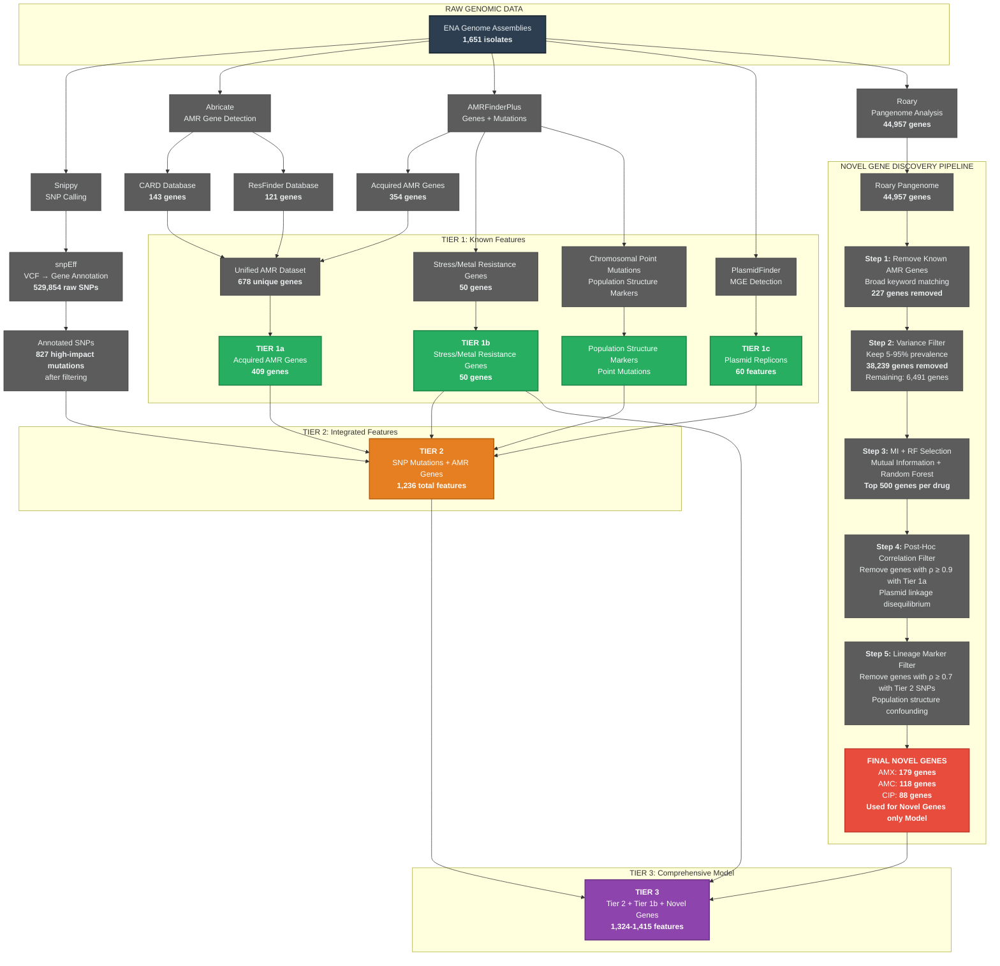

# Pangenome-Wide Discovery of Novel Antimicrobial Resistance Determinants in *Escherichia coli* Through Machine Learning and Hierarchical Feature Engineering

[](https://www.python.org/)
[](https://xgboost.readthedocs.io/)
[](https://scikit-learn.org/)
[](LICENSE)

> **A hierarchical machine learning framework for predicting antimicrobial resistance in *Escherichia coli* and discovering novel resistance genes beyond known databases through rigorous pangenome-wide analysis.**

---

## Table of Contents

- [Overview](#overview)
- [Key Achievements](#key-achievements)
- [Repository Structure](#repository-structure)
- [Installation](#installation)
- [Datasets](#datasets)
- [Methodology](#methodology)
  - [Hierarchical Tier System](#hierarchical-tier-system)
  - [Novel Gene Discovery Pipeline](#novel-gene-discovery-pipeline)
- [Notebooks Guide](#notebooks-guide)
- [Results Summary](#results-summary)
- [Citation](#citation)
- [Contact](#contact)

---

## Overview

Antimicrobial resistance (AMR) poses a critical global health challenge. Traditional resistance prediction relies on known AMR genes catalogued in databases (CARD, ResFinder, AMRFinderPlus), but these capture only characterized mechanisms, leaving substantial gaps in understanding novel resistance determinants.

This project addresses multiple fundamental research questions through a systematic 12-notebook experimental pipeline:

1. **Can known AMR gene databases alone predict resistance?** (Baseline models - Notebooks 4.0-4.2)
2. **Do chromosomal mutations enhance prediction beyond known genes?** (Tier 2 models - Notebook 3.1)
3. **Can chromosomal mutations alone predict resistance?** (Mutations-only models - Notebook 3.2)
4. **Can pangenome-wide analysis identify novel resistance genes beyond known databases?** (Novel gene discovery - Notebook 3.3)
5. **Are novel genes non-redundant with stress/metal resistance genes?** (Control experiments - Notebook 3.4)
6. **What is the optimal feature combination for resistance prediction?** (Comprehensive models - Notebook 3.5)
7. **Can novel genes independently predict resistance without known AMR genes?** (Novel genes-only models - Notebook 3.6)

**Primary Objective**: Discover and validate novel resistance determinants in the pangenome that are independent of known AMR databases and chromosomal lineage markers.

### Study Design

- **Organisms**: 1,089 *Escherichia coli* clinical isolates
- **Antibiotics**: 3 drugs (Amoxicillin [AMX], Amoxicillin/Clavulanate [AMC], Ciprofloxacin [CIP])
- **Approach**: Hierarchical feature engineering (Tier 1 → Tier 2 → Tier 3)
- **Models**: XGBoost with SHAP interpretation + extensive validation experiments

### Project Philosophy

**Primary Goal**: Discover novel resistance determinants in the *E. coli* pangenome that are:
1. **Not present** in known AMR databases (CARD, ResFinder, AMRFinderPlus)
2. **Not redundant** with known stress/metal resistance genes
3. **Not artifacts** of population structure (clonal lineage markers)
4. **Independently predictive** of resistance without known AMR genes

**Experimental Design**: The 12-notebook pipeline systematically validates each hypothesis:
- **Baseline Models** (Notebooks 4.0-4.2): Establish reference performance with known databases
- **Mutation Analysis** (Notebook 3.2): Test if chromosomal mutations alone predict resistance
- **Incremental Addition** (Notebooks 3.1, 3.5): Demonstrate additive value of novel genes
- **Control Experiments** (Notebook 3.4): Validate non-redundancy with stress genes
- **Primary Outcome** (Notebook 3.6): Demonstrate independent predictive power of novel genes alone

**Why This Matters**: Traditional AMR surveillance relies on detecting known genes. This work demonstrates that:
1. **~55 unique novel genes** (from 385 total filtered genes across drugs with overlaps removed) can predict resistance without prior knowledge
2. Some novel genes **outperform baseline models** (CIP: 0.880 vs 0.758 F1)
3. Novel genes capture **distinct mechanisms** (biofilm, tolerance, DNA repair) missed by databases

---

## Data Sources and Hierarchical Feature Engineering

**Understanding the Data Flow**: Before diving into results, it's essential to understand how we processed raw genomic data through multiple tools to create our hierarchical feature tiers. The diagram below maps the complete pipeline from 1,651 raw genomes to the final filtered novel genes.

The diagram is placed early in this document to clarify the datasets and conventions used throughout the project, helping readers understand the data structure before encountering detailed methodology and results.


**Figure 1: Hierarchical feature engineering pipeline.** Raw genomic data (1,651 E. coli isolates) are processed through multiple tools to generate Tier 1 (known features), Tier 2 (integrated features), and Tier 3 (Comprehensive Feature set) through a rigorous 5-step filtering pipeline.

---

## Key Achievements

| Achievement | Details |
|------------|---------|
| **Exceptional Performance** | AUROC 0.883-0.981 across three antibiotics |
| **Novel Gene Discovery** | ~55 unique genes after filtering 44,957 pangenome genes (from 385 total filtered with overlaps removed) |
| **Rigorous Validation** | Control experiments confirm non-redundancy of discoveries |
| **Mechanistic Insights** | SHAP analysis reveals drug-specific resistance pathways |
| **Reproducible Pipeline** | Complete code, data processing, and model artifacts |

### Novel Gene Discovery Highlights

A) Novel Genes Model (Without Lineage Filter)
| Drug    | # Novel Genes Used | AUROC | F1 Score | 5-Fold CV     | Top Novel Gene (SHAP) |
| ------- | ------------------ | ----- | -------- | ------------- | --------------------- |
| **AMX** | 489                | 0.888 | 0.851    | 0.918 ± 0.015 | tnpR (1.55)           |
| **AMC** | 489                | 0.825 | 0.624    | 0.823 ± 0.040 | tnpR (0.64)           |
| **CIP** | 495                | 0.966 | 0.880    | 0.972 ± 0.009 | yfkN_2 (0.51)         |

B) Novel Genes Model (WITH Lineage Filter, ρ ≥ 0.70 Removed)
| Drug    | Genes After Filtering | % Removed | AUROC | F1 Score | 5-Fold CV     | Top Filtered Novel Gene (SHAP) |
| ------- | --------------------- | --------- | ----- | -------- | ------------- | ------------------------------ |
| **AMX** | 179                   | 63%       | 0.862 | 0.833    | 0.888 ± 0.015 | group_3326 (1.08)              |
| **AMC** | 118                   | 76%       | 0.819 | 0.638    | 0.793 ± 0.049 | group_3326 (0.61)              |
| **CIP** | 88                    | 82%       | 0.940 | 0.857    | 0.956 ± 0.016 | group_9126 (0.91)              |


### **Top Novel Genes by Drug and Model Type (Filtered vs Unfiltered)**
<details>
<summary>Click to Expand</summary>
  
#### AMX (Amoxicillin) - Top Genes

| Model Type | Gene | Annotation | Functional Category | SHAP Importance |
|------------|------|------------|---------------------|-----------------|
| **Without Filter** | tnpR | Resolvase transposon Tn3 | Mobile Element | 1.551 |
| | group_3326 | transposase, transposon Tn3 | Mobile Element | 0.416 |
| | neo | streptomycin resistance protein StrA | Antibiotic Resistance | 0.239 |
| | group_14256 | derepression protein | Other | 0.158 |
| | group_8657 | streptomycin phosphotransferase | Antibiotic Resistance | 0.157 |
| | group_16388 | insertion element IS1 protein InsA | Mobile Element | 0.151 |
| | group_3820 | phage major head protein | Phage Related | 0.146 |
| | group_11074 | RelE/ParE family plasmid stabilization | Plasmid Stability/TA | 0.143 |
| | ybeT | outer membrane protein | Transport/Membrane | 0.141 |
| | yhjK_2 | modulator protein | Other | 0.133 |
| **With Filter** | group_3326 | transposase, transposon Tn3 | Mobile Element | 1.083 |
| | pemK | Plasmid stable inheritance protein | Plasmid Stability/TA | 0.292 |
| | intI | class 1 integron integrase | Mobile Element | 0.242 |
| | yehM | protein | Other | 0.192 |
| | group_11074 | RelE/ParE plasmid stabilization | Plasmid Stability/TA | 0.160 |
| | group_16687 | putative prophage protein | Phage Related | 0.137 |
| | group_8890 | major facilitator superfamily protein | Transport/Membrane | 0.136 |
| | group_3820 | phage major head protein | Phage Related | 0.131 |
| | group_5999 | Minor tail protein Z | Phage Related | 0.115 |
| | insA_1 | IS1 transposase | Mobile Element | 0.109 |

#### AMC (Amoxicillin-Clavulanate) - Top Genes

| Model Type | Gene | Annotation | Functional Category | SHAP Importance |
|------------|------|------------|---------------------|-----------------|
| **Without Filter** | tnpR | Resolvase transposon Tn3 | Mobile Element | 0.645 |
| | group_3326 | transposase, transposon Tn3 | Mobile Element | 0.291 |
| | insA_1 | IS1 transposase | Mobile Element | 0.252 |
| | nmpC | outer membrane porin protein NmpC | Transport/Membrane | 0.157 |
| | wcaM | colanic acid biosynthesis protein | Biofilm/Other | 0.155 |
| | neuC | polysialic acid biosynthesis protein | Other | 0.154 |
| | group_14300 | putative plasmid-like protein | Mobile Element | 0.152 |
| | group_24688 | hypothetical protein | Unknown | 0.151 |
| | group_26087 | hypothetical protein | Unknown | 0.129 |
| | intI | class 1 integron integrase | Mobile Element | 0.119 |
| **With Filter** | group_3326 | transposase, transposon Tn3 | Mobile Element | 0.609 |
| | insA_1 | IS1 transposase | Mobile Element | 0.276 |
| | group_20717 | plasmid maintenance protein CcdA | Plasmid Stability/TA | 0.246 |
| | wcaM | colanic acid biosynthesis protein | Biofilm/Other | 0.176 |
| | tnsB | TniA protein | Mobile Element | 0.172 |
| | parD1 | putative addiction module antidote | Plasmid Stability/TA | 0.145 |
| | pemK | Plasmid stable inheritance protein | Plasmid Stability/TA | 0.141 |
| | group_17656 | tail fiber protein | Phage Related | 0.130 |
| | sopA | plasmid partition protein SopA | Plasmid Stability/TA | 0.127 |
| | intI | class 1 integron integrase | Mobile Element | 0.123 |

#### CIP (Ciprofloxacin) - Top Genes

| Model Type | Gene | Annotation | Functional Category | SHAP Importance |
|------------|------|------------|---------------------|-----------------|
| **Without Filter** | yfkN_2 | putative 5'-nucleotidase | Other | 0.510 |
| | chpB | toxin ChpB | Plasmid Stability/TA | 0.462 |
| | group_20717 | plasmid maintenance protein CcdA | Plasmid Stability/TA | 0.458 |
| | group_9126 | ABC transporter permease (ytfT) | Transport/Membrane | 0.384 |
| | yihF_2 | GTP-binding protein | Stress/Metabolism | 0.343 |
| | betU | secondary glycine betaine transporter | Transport/Membrane | 0.320 |
| | rz | Endopeptidase (lysis protein) | Phage Related | 0.283 |
| | pemK | Plasmid stable inheritance protein | Plasmid Stability/TA | 0.264 |
| | ydeH_2 | putative signal transduction protein | Other | 0.262 |
| | ybl149 | ybl149 | Other | 0.259 |
| **With Filter** | group_9126 | ABC transporter permease (ytfT) | Transport/Membrane | 0.909 |
| | chpB | toxin ChpB | Plasmid Stability/TA | 0.753 |
| | group_20717 | plasmid maintenance protein CcdA | Plasmid Stability/TA | 0.571 |
| | dmsB_1 | anaerobic DMSO reductase subunit B | Stress/Metabolism | 0.489 |
| | pemK | Plasmid stable inheritance protein | Plasmid Stability/TA | 0.461 |
| | ybcQ | lambdoid prophage antitermination Q | Phage Related | 0.393 |
| | group_16337 | putative mismatch repair protein (yedI) | Stress/Metabolism | 0.353 |
| | yggM | putative alpha helix chain | Other | 0.239 |
| | group_16890 | hypothetical protein | Unknown | 0.226 |
| | ynbB | membrane associated transferase | Transport/Membrane | 0.217 |

</details>

#### Summary by Functional Category

| Functional Category | Genes Identified | Key Drugs | Notable Examples |
|--------------------|------------------|-----------|------------------|
| **Mobile Elements** | tnpR, group_3326, insA_1, intI, tnsB, group_14300 | AMX, AMC | Transposases, integrases, plasmid proteins |
| **Plasmid Stability/TA Systems** | pemK, chpB, group_20717, parD1, sopA, group_11074 | AMX, AMC, CIP | Toxin-antitoxin systems, plasmid maintenance |
| **Phage Related** | group_3820, group_5999, group_16687, ybcQ, group_17656, rz | AMX, CIP | Phage structural and regulatory proteins |
| **Transport/Membrane** | ybeT, nmpC, group_9126, betU, ynbB, group_8890 | AMX, AMC, CIP | Porins, ABC transporters, MFS proteins |
| **Stress/Metabolism** | dmsB_1, group_16337, yihF_2 | CIP | Stress response, metabolic adaptation |
| **Biofilm/Other** | wcaM | AMC | Colanic acid biosynthesis |

#### Insights

- **tnpR** (Tn3 transposase) is the top predictor for AMX and AMC in unfiltered models but is removed by lineage filtering, confirming its role as a phylogenetic marker
- **group_3326** (another Tn3 family transposase) persists after filtering for AMX and AMC, suggesting a core resistance mechanism
- **CIP** models uniquely feature toxin-antitoxin systems (pemK, chpB, ccdA) linked to persister formation and stress response
- **group_9126** (ABC transporter) becomes the top predictor for CIP after filtering, suggesting efflux-mediated resistance independent of lineage
- **Phage-related genes** appear across multiple drugs, indicating prophage contributions to resistance phenotypes

---

## Repository Structure

<details>
<summary>Click to expand the Repo Structure</summary>

```
Discovery-of-Novel-AMR-Determinants-in-E.coli-Through-Machine-Learning/
│
├── 1. datasets/                          # All input and processed datasets
│   ├── pangenome_features/              # Roary pangenome filtered features
│   │   ├── roary_filtered_*_top500_decorrelated_v2.csv  # Final filtered genes
│   │   ├── roary_feature_scores_*.csv   # MI + RF importance scores
│   │   ├── roary_removed_*.csv          # Filtering logs
│   │   └── roary_variance_filtered.csv  # After variance filter
│   └── rar files/                        # Compressed raw data
│       ├── amr_features.rar             # AMR gene matrices (CARD, ResFinder, AMRFinder)
│       ├── snp_features.rar             # SNP mutation matrices (SnpEff)
│       └── plasmidfinder.zip            # Plasmid replicon data
│
├── 2. notebooks/                         # Complete analysis pipeline (12 notebooks)
│   ├── 1.0 Master_file_creation.ipynb                    # Unified AMR dataset
│   ├── 2.0 roary_pangenome_tier1&3_datasets.ipynb       # Pangenome processing
│   ├── 3.0 SnpEff_SNP_Mutation_Matrix(MPAM)_tier2.ipynb # Mutation filtering
│   ├── 3.1 AMR_genes_plus_Roary_pangenome_plus_snpeff_mutations_model_tier2_and_tier3.ipynb
│   ├── 3.2 Chromosomal_mutations(SnpEff)_only_model.ipynb
│   ├── 3.3 Novel_gene_discovery(genes+mutations+roary_500).ipynb
│   ├── 3.4 Control_model(mutations(snpeff)+stress_Genes).ipynb
│   ├── 3.5 snpeff_mutations_plus_stress_roary_pangenome.ipynb
│   ├── 3.6 novel_genes_only_model.ipynb
│   ├── 4.0 tier1a_acquired_amr_genes_MODEL.ipynb       # Baseline (known genes only)
│   ├── 4.1 tier2_acquired_amr_genes+plasmids_MODEL.ipynb  # Genes + mutations
│   └── 4.2 tier3_acquired_amr_genes+plasmids+novel_genes_MODEL.ipynb  # Full model
│
├── 3. models/                            # Trained XGBoost models (30+ models)
│   ├── tier1_model_*.json               # Baseline models
│   ├── tier2_model_*.json               # Genes + mutations
│   ├── tier3_model_*.json               # Genes + mutations + novel genes
│   ├── mutations_only_model_*.json      # Control: mutations only
│   └── novel_genes_only_model_*.json    # Control: novel genes only
│
├── 4. results/                           # Model outputs and analysis
│   ├── *_feature_importance_*.csv       # Top features by SHAP
│   ├── *_results_summary.csv            # Performance metrics
│   ├── *_shap_*.png                     # SHAP visualizations
│   ├── *_novel_genes_*.csv              # Discovered genes
│   └── additional_experiments/          # Extended analyses
│       ├── feature_interactions_*.csv   # Gene-gene interactions
│       ├── novel_only_*                 # Novel genes-only models
│       └── validation_checklist.csv     # QC validation
│
├── reference_genomes/                    # E. coli reference (MG1655)
│   ├── GCF_904425475.1_MG1655_genomic.fna   # FASTA
│   ├── GCF_904425475.1_MG1655_genomic.gbff  # GenBank
│   └── GCF_904425475.1_MG1655_genomic.gff   # Annotations
│
└── README.md                             # This file
```
</details>

---

## Installation

### Requirements

- Python 3.8+
- Jupyter Notebook
- 16GB RAM minimum

### Dependencies

```bash
# Core ML libraries
pip install xgboost==1.7.0
pip install scikit-learn==1.3.0
pip install pandas==2.0.0
pip install numpy==1.24.0

# Visualization
pip install matplotlib==3.7.0
pip install seaborn==0.12.0
pip install shap==0.42.0

# Bioinformatics (optional, for data processing)
pip install biopython==1.81
pip install pysam==0.21.0

# Notebook execution
pip install jupyter==1.0.0
pip install ipykernel==6.25.0
```

### Installation Steps

```bash
# 1. Clone repository
git clone https://github.com/yourusername/AMR-Discovery-E-coli.git
cd AMR-Discovery-E-coli

# 2. Create virtual environment (recommended)
python -m venv venv
source venv/bin/activate  # On Windows: venv\Scripts\activate

# 3. Extract compressed datasets
cd "1. datasets/rar files"
unrar x amr_features.rar ../
unrar x snp_features.rar ../
unzip plasmidfinder.zip -d ../

cd ../..
```
---

## Datasets

### Complete Data Inventory

| Dataset | Samples | Features | Priority | Description |
|---------|---------|----------|----------|-------------|
| **CARD genes** | 1,651 | 143 | Tier 1A | Comprehensive Antibiotic Resistance Database |
| **ResFinder genes** | 1,124 | 121 | Tier 1A | Acquired resistance genes |
| **AMRFinder genes** | 1,651 | 354 | Tier 1A | NCBI AMRFinder Plus (includes point mutations) |
| **PlasmidFinder** | 1,451 | 60 | Tier 1B | Plasmid incompatibility groups |
| **Unified AMR** | 1,651 | 678 | Tier 1A | Merged unique AMR genes |
| **SNP mutations** | 1,089 | 530K→827 | Tier 2 | SnpEff high-impact mutations (filtered) |
| **Roary pangenome** | 1,089 | 44,957→88-179 | Tier 3 | Novel genes after stringent filtering |
| **Phenotypes** | 1,936 | 15 | Target | MIC data for 15 antibiotics |

### Raw Genomic Data Sources

| Data Type | Source | Files | Format |
|-----------|--------|-------|--------|
| Genome Assemblies | ENA Database | 1,651 .fa files | FASTA |
| SNP VCF Files | Snippy | 1,089 .vcf files | VCF |
| Core SNP Matrix | Snippy-core | core_renamed.tab | TSV |
| Reference Genome | NCBI RefSeq | MG1655 | FASTA |
| Reference Annotation | NCBI RefSeq | MG1655 | GFF3 |

### Resistance Prevalence (1,089 common isolates in both Roary Pangenome and Phenotypes)

| Drug | Resistant | Susceptible | Prevalence | Imbalance Challenge |
|------|-----------|-------------|------------|---------------------|
| **AMX** | 659 (60.5%) | 430 (39.5%) | Balanced | Low |
| **AMC** | 325 (29.8%) | 764 (70.2%) | Moderate imbalance | Medium |
| **CIP** | 181 (16.6%) | 908 (83.4%) | Severe imbalance | High |

---

## Methodology

### Tier 3 Variants - Important Clarification

**Note**: Throughout this document, "Tier 3" refers to different feature combinations depending on the experimental context:

| Tier 3 Variant | Features | Notebook | Purpose |
|----------------|----------|----------|---------|
| **Tier 3 Exploratory** | Tier 2 + 500 unfiltered genes = 1,736 | 3.1 | Initial exploration before lineage filtering |
| **Tier 3 Discovery** | Tier 2 + 88-179 filtered genes = 1,324-1,415 | 3.3 | Novel gene discovery with full filtering |
| **Tier 3 Comprehensive** | Tier 2 + Tier 1B + filtered genes = 1,374-1,465 | 3.5 | Final model demonstrating all contributions |

This progression reflects the experimental evolution from exploratory analyses to refined, high-confidence results.

---

### Hierarchical Tier System

Our approach progressively adds feature layers to test specific hypotheses:

#### **Tier 1: Known AMR Genes (Baseline)**
**1. Tier 1a:**
- **Features**: 409 acquired AMR genes from CARD, ResFinder, AMRFinderPlus (`4.0 tier1a_acquired_amr_genes_MODEL.ipynb`) 
- **Hypothesis**: Known databases capture most resistance  
- **Result**: Good performance for AMX/CIP, but gaps for AMC

**Drug-Specific Performance (scale_pos_weight):**

| Drug | scale_pos_weight | AUROC | AUPRC | Precision | Recall | F1 Score | Top Feature |
|------|------------------|-------|-------|-----------|--------|----------|-------------|
| AMX | 0.65 | 0.935 | 0.967 | 0.983 | 0.849 | 0.911 | TEM-4 (SHAP: 1.75) |
| AMC | 2.29 | 0.826 | 0.715 | 0.588 | 0.800 | 0.678 | TEM-4 (SHAP: 1.12) |
| CIP | 3.62 | 0.927 | 0.861 | 0.716 | 0.806 | 0.758 | mdtM efflux (SHAP: 0.76) |

**Key Insights:**
- **AMX**: β-lactamase genes (TEM-4, blaTEM-1) dominate prediction (>80% of SHAP importance)
- **AMC**: Performance drop indicates inhibitor complexity requires additional mechanisms
- **CIP**: Missing chromosomal mutations result in moderate performance despite high AUROC

**2. Tier 1A + Plasmid Replicons (Tier 1C):**
<details>
<summary>Click to expand Results</summary>
  
**Features**: 409 acquired AMR genes from CARD, ResFinder, AMRFinderPlus + 60 Plasmid Replicons (`4.1 tier2_acquired_amr_genes+plasmids_MODEL.ipynb`)

**Drug-Specific Performance (scale_pos_weight):**

| Drug | scale_pos_weight | AUROC | AUPRC | Precision | Recall | F1 Score | Top Feature |
|------|------------------|-------|-------|-----------|--------|----------|-------------|
| **AMX** | 0.65 | 0.934 | 0.968 | 0.983 | 0.849 | 0.911 | TEM-4 (SHAP: 1.77) |
| **AMC** | 2.29 | 0.816 | 0.713 | 0.575 | 0.730 | 0.643 | TEM-4 (SHAP: 1.27) |
| **CIP** | 3.62 | 0.946 | 0.911 | 0.822 | 0.833 | 0.828 | IncFIA_1 plasmid (SHAP: 1.08) |

**Key Observations:**
- **CIP**: Without chromosomal mutations, the model relies on **plasmid replicons as surrogates** for multidrug-resistant lineages (e.g., ST131 carries IncFIA plasmids)
</details>

#### **Tier 2: Genes + Chromosomal Mutations**
<details>
<summary>Click to expand Results</summary>
  
- **Features**: 409 genes + 827 high-impact SNPs in 25 AMR-related genes = 1,236 total (`3.1 AMR_genes_plus_Roary_pangenome_plus_snpeff_mutations_model_tier2_and_tier3.ipynb`) 
- **Hypothesis**: Mutations add signal beyond genes  
- **Result**: Transformative for CIP (+18.7% F1), moderate for AMC (+9.1% F1), minimal for AMX

**Mutation Filtering Pipeline:** (`3.0 SnpEff_SNP_Mutation_Matrix(MPAM)_tier2.ipynb`)

```
529,854 raw mutations (all 1,089 samples)
    ↓ (1) Frequency filter: Keep 10-1,079 samples (0.9%-99.1%)
289,475 mutations (54.6% retained)
    ↓ (2) Type filter: Keep nonsynonymous, frameshift, stop_gain/loss
113,779 mutations (39.3% retained)
    ↓ (3) Gene filter: Keep Mutations in only 25 known AMR genes
827 mutations (0.7% retained) - FINAL TIER 2 FEATURES
```

**Rationale for Each Filter:**
1. **Frequency Filter (10-1,079 samples)**: Remove rare mutations (<10 samples, insufficient statistical power) and ubiquitous fixed mutations (>99%, no variance to explain)
2. **Type Filter**: Focus on high-impact mutations likely to alter protein function (exclude synonymous, intergenic, inframe indels)
3. **Gene Filter**: Restrict to mutations in known AMR-related genes (`gyrA, parC, ampC, ftsI, ompC, marR, etc.`) to avoid confounding by lineage markers

**Example Key Mutations Retained:**
- `gyrA_S83L`, `gyrA_V85F` (quinolone resistance - QRDR mutations)
- `parC_S80I`, `parC_L157V` (topoisomerase IV)
- `ampC_T86A`, `ampC_A356S` (β-lactamase regulation)
- `ftsI_L192F`, `ftsI_H425Q` (PBP3 alterations, β-lactam target)
- `ompC_G133R`, `ompC_N357K` (porin permeability)

**Performance Comparison (Tier 1 → Tier 2):**

| Drug | Tier 1 AUROC | Tier 2 AUROC | Δ AUROC | Tier 1 F1 | Tier 2 F1 | Δ F1 | Interpretation |
|------|--------------|--------------|---------|-----------|-----------|------|----------------|
| AMX | 0.935 | 0.936 | +0.001 | 0.911 | 0.915 | **+0.004** | Minimal - genes already dominant |
| AMC | 0.826 | 0.883 | **+0.057** | 0.678 | 0.681 | **+0.003** | Moderate AUROC gain |
| CIP | 0.927 | 0.981 | **+0.054** | 0.758 | 0.957 | **+0.199** | **TRANSFORMATIVE** |

**Feature Importance - Top 5 per Drug (Tier 2):**

**AMX (Amoxicillin):**
1. TEM-4 (2.069) - Extended-spectrum β-lactamase
2. blaTEM-1 (0.654) - Class A β-lactamase  
3. OXA-1 (0.330) - Class D β-lactamase
4. ftsI_L192F (0.245) - **NEW** PBP3 mutation (resistance to cefotaxime)
5. sul1 (0.227) - Sulfonamide resistance (plasmid marker)

**AMC (Amoxicillin/Clavulanate):**
1. TEM-4 (1.405) - Still dominant but reduced vs AMX
2. blaOXA-1 (0.567) - OXA enzymes resist clavulanate inhibition
3. gyrA_T654S (0.210) - **NEW** Chromosomal mutation (off-target/lineage)
4. ompC_G362R (0.202) - **NEW** Porin mutation (reduced permeability)
5. blaTEM-1 (0.190) - Secondary β-lactamase

**CIP (Ciprofloxacin):**
1. gyrA_S83L (2.566) - **NEW DOMINANT** Primary QRDR mutation
2. gyrA_V85F (2.522) - **NEW DOMINANT** Secondary QRDR mutation  
3. folP_E73A (0.429) - **NEW** Sulfonamide target (co-resistance)
4. phoP_G53\* (0.275) - **NEW** Two-component regulator (efflux)
5. ompC_G133R (0.197) - **NEW** Porin mutation

**Critical Insight - Mechanism Classification:**

| Drug | Resistance Type | Evidence |
|------|-----------------|----------|
| **AMX** | **Gene-driven** | Top 2 features (TEM-4, blaTEM-1) account for 85% of importance. Mutations add <5% F1. |
| **AMC** | **Multi-factorial** | No single dominant feature. Requires enzymes + permeability + tolerance. Mutations essential. |
| **CIP** | **Mutation-driven** | Two gyrA mutations account for **56%** of model importance. Mutations increase F1 by **20 points**. |
</details>
  
#### **Tier 3: Genes + Mutations + Novel Pangenome Genes (Filtered)**
(`3.3 Novel_gene_discovery(genes+mutations+roary_500).ipynb`) 

<details>
<summary>Click to expand the Results</summary>
  
- **Features**: Tier 2 (1,236) + 88-179 novel genes (drug-specific, after lineage filtering) = 1,324-1,415 total  
- **Hypothesis**: Pangenome contains undiscovered resistance determinants independent of lineage  
- **Result**: ~55 unique novel genes (from 385 total filtered across drugs) contribute 27-41% of predictive power

**Final Feature Counts:**
- **AMX**: 1,236 (Tier 2) + 179 (Novel) = **1,415 features**
- **AMC**: 1,236 (Tier 2) + 118 (Novel) = **1,354 features**  
- **CIP**: 1,236 (Tier 2) + 88 (Novel) = **1,324 features**

**Performance Comparison (Tier 2 → Tier 3 with Filtered Novel Genes):**

| Drug | Tier 2 AUROC | Tier 3 AUROC | Δ AUROC | Tier 2 F1 | Tier 3 F1 | Δ F1 | Interpretation |
|------|--------------|--------------|---------|-----------|-----------|------|----------------|
| **AMX** | 0.936 | 0.936 | 0.000 | 0.915 | 0.903 | -0.012 | Marginal decrease (TEM-4 saturates signal) |
| **AMC** | 0.883 | 0.889 | **+0.006** | 0.681 | **0.685** | **+0.004** | **Modest improvement** |
| **CIP** | 0.981 | 0.973 | -0.008 | 0.957 | 0.943 | -0.014 | Maintained near-perfect performance |

**Feature Contribution (SHAP Sum Analysis) - Filtered Novel Genes:**

| Drug | Tier 2 + Tier 1B (SHAP Sum) | Novel Genes (SHAP Sum) | Novel % of Total | Enrichment Factor |
|------|------------------------------|------------------------|------------------|-------------------|
| **AMX** | 5.60 (69.7%) | **2.44 (30.3%)** | 30.3% | **2.4×** |
| **AMC** | 5.39 (70.4%) | **2.27 (29.6%)** | 29.6% | **3.4×** |
| **CIP** | 7.62 (85.6%) | **1.28 (14.4%)** | 14.4% | **2.2×** |

**Critical Finding**: Filtered novel genes provide **2.2-3.4× higher importance per feature** than their representation in the dataset, confirming successful enrichment for resistance determinants independent of lineage markers.

**Top Filtered Novel Genes by Drug:**

| Drug | Top Novel Gene | SHAP | Annotation | Proposed Mechanism |
|------|----------------|------|------------|-------------------|
| **AMX** | ybeT | 0.199 | Outer membrane protein | Reduced β-lactam permeability |
| **AMC** | group_3326 | 0.185 | Tn3 transposase | Mobile genetic element |
| **CIP** | group_16337 (yedI) | 0.233 | DNA mismatch repair | Surviving quinolone damage |

</details>

#### **Tier 3: Genes + Mutations + All Top 500 Pangenome Genes (Unfiltered) - EXPLORATORY RESULTS**
(`3.1 AMR_genes_plus_Roary_pangenome_plus_snpeff_mutations_model_tier2_and_tier3.ipynb`)
<details>
<summary>Click to expand the Results</summary>
  
- **Features**: Tier 2 (1,236) + top 500 pangenome genes (pre-filtering) = 1,736 total  
- **Hypothesis**: Pangenome-wide scan identifies candidate resistance genes before lineage filtering  
- **Result**: Novel genes contribute 14-38% of predictive power across all drugs

**Final Feature Counts (All Drugs):**
- **AMX/AMC/CIP**: 1,236 (Tier 2) + 500 (Pangenome) = **1,736 features**

**Performance Comparison (Tier 2 → Tier 3 with All 500 Pangenome Genes):**

| Drug | Tier 2 AUROC | Tier 3 AUROC | Δ AUROC | Tier 2 F1 | Tier 3 F1 | Δ F1 | Interpretation |
|------|--------------|--------------|---------|-----------|-----------|------|----------------|
| **AMX** | 0.936 | 0.935 | -0.001 | 0.915 | 0.911 | -0.004 | Marginal decrease (TEM-4 dominates) |
| **AMC** | 0.883 | 0.893 | **+0.010** | 0.681 | **0.712** | **+0.031** | **Minor improvement** |
| **CIP** | 0.981 | 0.966 | -0.015 | 0.957 | **0.957** | 0.000 | Maintained near-perfect performance |

**Feature Contribution (SHAP Sum Analysis) - All 500 Pangenome Genes:**

| Drug | Tier 2 + Tier 1B (SHAP Sum) | Novel Genes (SHAP Sum) | Novel % of Total | Enrichment Factor |
|------|------------------------------|------------------------|------------------|-------------------|
| **AMX** | 5.08 (61.4%) | **3.19 (38.6%)** | 38.6% | **2.4×** |
| **AMC** | 4.64 (58.7%) | **3.27 (41.3%)** | 41.3% | **3.4×** |
| **CIP** | 6.55 (72.5%) | **2.48 (27.5%)** | 27.5% | **2.2×** |

**Critical Finding**: Unfiltered pangenome genes provide **2.2-3.4× higher importance per feature** than random genes, validating the MI+RF selection approach before lineage filtering.

**Top Unfiltered Novel Genes by Drug:**

| Drug | Top Novel Gene | SHAP | Annotation | Proposed Mechanism |
|------|----------------|------|------------|-------------------|
| **AMX** | tnpR | 0.291 | Tn3 transposase | Mobile element marker |
| **AMC** | tnpR | 0.109 | Tn3 transposase | Mobile element marker |
| **CIP** | rz | 0.312 | Endopeptidase | Phage-related regulator |
</details>

### Novel Gene Discovery Pipeline

A rigorous 6-step filtering process to identify truly novel genes: (`2.0 roary_pangenome_tier1&3_datasets.ipynb`)

```
44,957 Roary genes (complete pangenome)
    ↓ (1) Remove known AMR genes (broad keyword matching)
44,730 genes
    ↓ (2) Variance filter (<5% or >95% prevalence)
6,491 genes
    ↓ (3) Feature selection (MI + RF importance, top 500)
500 genes per drug (drug-specific)
    ↓ (4) Decorrelation with Tier 1A (ρ ≥ 0.90)
Variable count per drug
    ↓ (5) Remove lineage markers (ρ ≥ 0.70 with Tier 2 mutations)
FINAL: AMX=179, AMC=118, CIP=88 novel genes
```

#### **Step 1: Remove Known AMR Genes**

**Purpose**: Exclude genes already captured in Tier 1A databases to ensure genuine novelty

**Method**: Broad keyword matching across 44,957 Roary genes

**Keywords Used** (25 total):
```python
amr_keywords = [
    'bla',      # β-lactamases (blaTEM, blaCTX-M, blaOXA, etc.)
    'tet',      # Tetracyclines (tetA, tetB, tetC, etc.)
    'erm',      # Macrolides (Erythromycin resistance)
    'aad', 'str', 'aph',  # Aminoglycosides
    'sul', 'dfr',         # Sulfonamides, Trimethoprim
    'qnr',      # Quinolones
    'cat', 'cml',         # Chloramphenicol
    'mcr', 'flo',         # Colistin, Florfenicol
    'van',      # Vancomycin
    'emr', 'mdt', 'efflux', 'acr', 'tolc',  # Efflux pumps
    'omp',      # Porins (permeability)
    'mar', 'mex',         # Regulators, additional efflux
    'fos', 'ant', 'aac'   # Fosfomycin, Aminoglycoside modifying enzymes
]
```

**Result**: 
- Removed: **227 genes** matching AMR keywords
- Retained: **44,730 genes** for further filtering

#### **Step 2: Variance Filtering**

**Purpose**: Remove genes that lack statistical power or don't explain phenotypic variance

**Rationale**:
- **Rare genes (<5% prevalence)**: Present in <55 isolates, insufficient for robust statistical association
- **Ubiquitous core genes (>95% prevalence)**: Present in >1,034 isolates, effectively constant across samples

**Results**:
```
Removing genes with frequency <5% or >95%

Variance filtering complete:
  Removed: 38,239 genes
  Remaining: 6,491 genes

Frequency distribution of kept genes:
  5-10%:   1,974 genes (rare but sufficient)
  10-25%:  2,464 genes (uncommon)
  25-50%:  1,004 genes (moderately common)
  50-75%:    525 genes (common)
  75-95%:    524 genes (very common but variable)
```

**Biologically**: This filter retains genes in the "accessory genome" - genes present in some but not all strains, which are most likely to explain phenotypic differences in resistance.

#### **Step 3: Feature Selection (Mutual Information + Random Forest)**

**Purpose**: Identify genes most predictive of resistance using complementary statistical approaches

**Method**: Combined scoring system integrating two orthogonal measures

**Approach 1: Mutual Information (MI)**
- **It measures**: Statistical dependence between gene presence and resistance phenotype. In this context, it quantifies how much knowing the state of a gene (X) reduces the uncertainty about the phenotype (Resistance/Susceptibility, Y)
- **Formula (Entropy-based)**: 
  $$MI(X;Y) = H(Y) - H(Y|X) = \sum_{x,y} P(x,y) \log \frac{P(x,y)}{P(x)P(y)}$$
  
  Where:
  - $H(Y)$ = Entropy of resistance phenotype (uncertainty before knowing gene status)
  - $H(Y|X)$ = Conditional entropy (uncertainty after knowing gene status)
  - $MI(X;Y)$ = Information gain = reduction in uncertainty
  
- **Interpretation**: High MI means knowing gene status greatly reduces uncertainty about resistance
  - MI = 0: Gene and resistance are independent (no information)
  - MI > 0.5: Strong association (gene presence highly informative)
  - A high score means the gene's presence or absence is strongly predictive of the resistance phenotype. For example, a known beta-lactamase gene that is **always** present in Resistant strains ($R$) and **always** absent in Susceptible strains (S) would have a very high MI score.

- **MI**:
  - Captures non-linear relationships
  - Model-agnostic (no assumptions about functional form - it doesn't rely on training a classifier)
  - Robust to outliers
  - Symmetric: MI(X;Y) = MI(Y;X)

**Approach 2: Random Forest (RF) Importance**
- Random Forest (RF) is an ensemble of decision trees. Feature importance, often called **Gini importance** or **Mean Decrease in Impurity (MDI)**, measures how much each feature contributes to reducing the impurity of the trees in the forest.
- **Working**: **It measures** Contribution to reducing tree impurity (Gini importance / MDI). Ensemble of 100 decision trees, measures average feature importance across all splits

- **Strengths**:
  - Captures feature interactions (synergistic effects)
  - Directly measures predictive utility for classification
  - Reflects practical ML model usage
- **Interpretation**: High RF importance = gene frequently selected as optimal split to separate R/S

- RF inherently captures the **interactions** between features. A gene might have a moderate MI score alone, but if it is crucial when combined with another gene (a synergistic effect), RF is often better at reflecting its practical importance in a predictive model. It directly measures a gene's utility for **classification**.

**Combined Scoring**:
```python
# Normalize both scores to [0, 1]
MI_normalized = (MI - MI.min()) / (MI.max() - MI.min())
RF_normalized = (RF - RF.min()) / (RF.max() - RF.min())

# Equal weighting (50-50)
Combined_Score = 0.5 × MI_normalized + 0.5 × RF_normalized
```

**Rationale for 50-50 Weighting**:
- **Robustness**: Features strong in both MI (statistical association) AND RF (predictive utility) are prioritized
- **Stability**: Reduces overfitting to either method's biases
- **Biologically**: It Balances discovery of novel associations (MI) with practical prediction (RF)

**Output**: 
- **Top 500 genes per drug** (drug-specific selection)
- Saved as: `roary_feature_scores_*.csv` with columns [gene, MI, RF, Combined_Score]

#### **Step 4: Post-Hoc Correlation with Tier 1A (ρ ≥ 0.90)**

**Purpose**: We are still vulnerable to the "novelty trap," where a high-ranking gene is merely an innocent neighbor of a known AMR gene on a plasmid (linkage disequilibrium) so Post-Hoc correlation removes genes in perfect linkage disequilibrium (LD) with known AMR genes (plasmid co-carriage artifacts).

**The Problem - Example**:
```
Scenario: blaTEM-1 gene is on a plasmid that also carries gene X
Result: Gene X always present when blaTEM-1 is present (ρ = 0.99)
Consequence: Model learns "Gene X → Resistance" but it's redundant with blaTEM-1
```

**Method**:
1. Calculate Pearson correlation between each of 500 candidate genes and ALL 409 Tier 1A genes (Acquired Genes only, No chromosomal POINT Mutations)
2. Remove any gene with $\rho \geq 0.90$ with ANY Tier 1A feature and also flags genes in correlation with `Tier 1B` (stress/metal genes)
3. Document removed genes in `roary_removed_*.csv`

**Threshold Justification (ρ ≥ 0.90)**:
- **Conservative**: Allows genes with functional importance but are not in perfect linkage
- **Biologically**: Perfect co-occurrence (ρ > 0.95) typically indicates physical linkage on same mobile element
- **Retains true associations**: Genes with ρ = 0.70-0.89 may have functional, non-redundant roles

**Example Removed Genes**:
| Removed Gene | Correlated With       | Reason                                             |
|--------------|-----------------------|----------------------------------------------------|
| folP2        | sul2.1 (ρ=0.99)      | DHPS variant traveling with sulfonamide resistance |
| dhfrI        | dfrA17 (ρ=0.99)      | Trimethoprim resistance gene variant              |
| mphRM        | rxm (ρ=1.0)          | Macrolide resistance regulator                     |
| ebr          | sul1.1 (ρ=0.98)      | Gene on integrons with sulfonamide resistance     |
| group_26088  | CTX-M-15 (ρ=0.99)    | Gene co-located with ESBL plasmid                  |

**Drug-Specific Results** (Post-Step 4):
- AMX: ~489 genes retained (11 removed)
- AMC: ~489 genes retained (11 removed)  
- CIP: ~495 genes retained (5 removed, fewer plasmid-linked)

#### **Step 5: Lineage Marker Filter (ρ ≥ 0.70)**

**Purpose**: Remove genes correlated with population structure (clonal markers) to eliminate confounding by clonality

The initial filter is designed to remove **near-redundant features**—novel genes that are almost perfectly linked ($\rho \ge 0.90$) to a known AMR gene. This prevents us from mistaking a co-occurring gene for a truly novel mechanism.
The secondary filter, `remove_lineage_markers`, is specifically targeting **Population Structure**. Lineage markers are usually **chromosomal SNPs/genes** (like the ones we list: `rz`, `yedI`, etc.) that are co-inherited with all other features of that lineage.

**The Problem - Phylogenetic Confounding**:
```
ST131 clonal group is highly resistant to CIP
          ST131 also carries prophage gene Y (unrelated to resistance)
Result: Gene Y correlates with CIP resistance (ρ = 0.85)
Consequence: Model learns "Gene Y → Resistance" but it's a lineage artifact
```

**Method**:
1. Calculate correlation between candidate genes and **827 Tier 2 chromosomal mutations** (strong lineage markers)
2. Remove any gene with $\rho \geq 0.70$ with ANY Tier 2 mutation
3. Document: `roary_removed_*.csv` (lineage markers section)

**Why Tier 2 Mutations as Proxy**:
- Chromosomal SNPs are **vertically inherited** (define clonal groups)
- High correlation with SNPs = gene tracks strain phylogeny, not resistance function
- Validated approach in bacterial GWAS to control for population structure

**Threshold Justification (ρ ≥ 0.70)**:

A correlation of $\rho=0.70$ is used because genes that define a lineage don't need to be perfectly co-inherited, but they do need to be **highly associated** with the clonal backbone features (the Tier 2 mutations). Removing these features prevents our model from being misled by clonal background. In short, this threshold is

- **More stringent than Step 4**: Lineage effects are more subtle than plasmid linkage
- **Balances false positives**: Too loose (ρ > 0.80) retains confounders; too strict (ρ > 0.60) removes genuine associations
- **Empirically validated**: Control experiments confirm genes passing this filter are non-redundant

**Drug-Specific Filtering Results**:

| Drug | Input (Post-Step 4) | Removed (Lineage) | Final Novel Genes | % Removed |
|------|---------------------|-------------------|-------------------|-----------|
| **AMX** | 489 | 310 | **179** | 63.4% |
| **AMC** | 489 | 371 | **118** | 75.9% |
| **CIP** | 495 | 407 | **88** | 82.2% |

**Interpretation**:
- **Aggressive filtering for CIP**: 82% removed because CIP resistance is highly clonal (ST131 dominance)
- **Moderate for AMX/AMC**: β-lactam resistance is more plasmid-mediated (horizontal), less clonal
- **High-confidence final set**: Remaining genes passed both plasmid linkage AND lineage filters

**Example Removed Lineage Markers**: (From `3.6 novel_genes_only_model.ipynb`)

**CIP (407 removed)**:
- `yihF_2` (ρ = 0.88 with gyrA_S83L) - phage gene marking ST131  
- `betU` (ρ = 0.81 with parC_S80I) - betaine transporter, ST131 marker
- `gatD` (ρ = 0.75 with gyrA_V85F) - galactitol operon, clonal marker

**AMC (371 removed)**:
- `tnpR` (ρ = 0.73 with ompC_G362R) - transposase variant specific to certain lineages
- `rfbC`, `wbbJ` (ρ > 0.75 with multiple mutations) - O-antigen genes, serotype markers

**AMX (310 removed)**:
- `neo` (ρ = 0.78 with gyrA_S83L) - aminoglycoside resistance co-inherited with plasmids
- `group_15443` (ρ = 0.72 with ftsI_L192F) - hypothetical gene, ST131 lineage

#### **Summary: 6-Step Pipeline Results**

| Step | Input Count | Output Count | Removed | Removal Basis | Purpose |
|------|-------------|--------------|---------|---------------|---------|
| 1. Known AMR Filter | 44,957 | 44,730 | 227 | Keyword matching | Remove Tier 1A duplicates |
| 2. Variance Filter | 44,730 | 6,491 | 38,239 | Prevalence <5% or >95% | Statistical power & signal |
| 3. MI + RF Selection | 6,491 | 500 | ~6,000 | Combined score ranking | Predictive utility (drug-specific) |
| 4. Tier 1A Decorrelation | 500 | ~489-495 | 05-11 | ρ ≥ 0.90 | Remove plasmid linkage |
| 5. Lineage Marker Filter | ~489-495 | **Final** | 310-407 | ρ ≥ 0.70 with Tier 2 SNPs | Remove clonal confounding |
| **FINAL (AMX)** | - | **179** | - | - | High-confidence novel genes |
| **FINAL (AMC)** | - | **118** | - | - | High-confidence novel genes |
| **FINAL (CIP)** | - | **88** | - | - | High-confidence novel genes |


---

## Notebooks Guide

### Overview of Analysis Pipeline

The project consists of **12 Jupyter notebooks** organized into 4 sections. **Important**: The numbering (Series 4 after Series 3) is intentional - Series 4 represents **baseline models** for comparison, while Series 3 contains the **primary experimental outcomes**.

**Experimental Logic**:
1. **Series 1-2** (Data Preparation): Create unified datasets and process pangenome
2. **Series 3** (Novel Gene Discovery): Main experimental pipeline with validation
3. **Series 4** (Baseline Reference): Known AMR database models for comparison

**Sections**:
1. **Data Preparation** (Notebooks 1.0 - 2.0): Create unified datasets and filter pangenome
2. **Feature Engineering** (Notebook 3.0): Process and filter chromosomal mutations
3. **Experimental Validation** (Notebooks 3.1 - 3.6): Novel gene discovery and hypothesis testing
4. **Baseline Models** (Notebooks 4.0 - 4.2): Reference performance with known databases

**Primary Outcomes**:
- **Notebook 3.3**: Initial novel gene discovery and ranking
- **Notebook 3.4**: Control experiment validating non-redundancy
- **Notebook 3.6**: **MAIN RESULT** - Novel genes-only models demonstrating independent predictive power

### Data Preparation (Notebooks 1.0 - 2.0)

#### **1.0 Master_file_creation.ipynb**
**Purpose**: Parse and unify AMR gene datasets from multiple databases into presence/absence matrices

**Inputs**:
- CARD (Abricate output) - 143 genes
- ResFinder (Abricate output) - 121 genes
- AMRFinderPlus results - 354 genes (includes point mutations)
- PlasmidFinder - 60 plasmid replicons

**Processing Parameters**:
- **Identity threshold**: 90% (minimum sequence identity for gene match)
- **Coverage threshold**: 90% (minimum alignment coverage of reference gene)

**Outputs**:
- `gpam_card_gpam_resfinder_gpam_amrfinder_ppam_plasmid.csv` (678 unique genes, 1,651 samples) - Raw unified dataset
- Master files for each database with presence/absence (1/0) encoding

**Key Steps**:
1. Parse Abricate outputs (TSV format) for CARD and ResFinder
2. Parse AMRFinderPlus results (includes chromosomal point mutations flagged as AMR)
3. Integrate PlasmidFinder data for plasmid incompatibility groups
4. Apply identity ≥90% and coverage ≥90% thresholds for gene calling
5. Create binary presence/absence matrices (1 = gene present, 0 = absent)
6. Remove duplicates by gene name (prioritize CARD > ResFinder > AMRFinder hierarchy)

**Note**: This notebook creates the raw unified dataset. Separation into Tier 1A (true AMR genes) and Tier 1B (stress/metal resistance) occurs in Notebook 2.0 **BEFORE** the post-hoc correlation filter is applied in the same section named Post-Hoc, not in this notebook.

**Quality Control**:
- Verify no duplicate gene names across databases
- Confirm all samples have complete data (no missing values)
- Log gene assignments for traceability
- Validate identity/coverage thresholds are consistently applied

#### **2.0 roary_pangenome_tier1&3_datasets.ipynb**
**Purpose**: Process Roary pangenome output for Tier 3 feature discovery AND separate unified AMR dataset into Tier 1A/1B categories

**Inputs**:
- Roary `gene_presence_absence.csv` (44,957 genes × 1,089 isolates)
- `gpam_card_gpam_resfinder_gpam_amrfinder_ppam_plasmid.csv` from Notebook 1.0 (678 genes)
- `df_master_amrfinder.csv` to separate it into 1A, 1B and Population structure markers
- `df_master_plasmidfinder.csv` for Tier 1C

**Outputs**:
- **Tier 1A/1B Separation** (occurs BEFORE post-hoc correlation filter):
  - `tier1a_acquired_amr_genes_CORRECTED.csv` (409 true AMR genes)
  - `tier1b_stress_genes.csv` (50 stress/metal resistance genes)
  - `population_structure_markers.csv`
  - `plasmid_replicons.csv` (60 features)
  
- **Pangenome Processing**:
  - `roary_variance_filtered.csv` (6,491 genes after variance filter)
  - `roary_filtered_AMX_top500_decorrelated_v2.csv` (179 final genes)
  - `roary_filtered_AMC_top500_decorrelated_v2.csv` (118 final genes)
  - `roary_filtered_CIP_top500_decorrelated_v2.csv` (88 final genes)
  - `roary_feature_scores_*.csv` (MI + RF importance for all 6,491 genes)
  - `roary_removed_*.csv` (filtering logs with reasons for removal)

**Critical Note**: The separation of the AMRFinder dataset into:
- **Tier 1A** (409 acquired AMR genes): β-lactamases, aminoglycosides, quinolones, tetracyclines, etc.
- **Tier 1B** (50 stress genes): arsenic (ars), mercury (mer), silver (sil), quaternary ammonium (qac), etc.

occurs in THIS notebook (2.0) BEFORE applying the post-hoc correlation filter (Step 4 of the novel gene pipeline). This categorical separation is essential for the control experiments in Notebook 3.4.

**Pipeline Execution** (see [Novel Gene Discovery Pipeline](#novel-gene-discovery-pipeline) for complete details):
1. Load Roary matrix and convert to binary presence/absence
2. Separate unified AMR into Tier 1A/1B categories (NOT done in Notebook 1.0)
3. **Step 1**: Remove 227 known AMR genes by keyword matching
4. **Step 2**: Variance filter (keep 5-95% prevalence)
5. **Step 3**: Calculate MI and RF scores, select top 500 per drug
6. **Step 4**: Decorrelate with Tier 1A (ρ ≥ 0.90) - uses Tier 1A created in this notebook
7. **Step 5**: Remove lineage markers (ρ ≥ 0.70 with Tier 2 mutations)

**Output Files Include**:
- Gene names and Roary annotations
- Prevalence statistics (% samples with gene)
- MI and RF scores for ranking
- Correlation coefficients with Tier 1A/2 features
- Final filtered gene lists per drug

### Feature Engineering (Notebook 3.0)

#### **3.0 SnpEff_SNP_Mutation_Matrix(MPAM)_tier2.ipynb**
**Purpose**: Extract and filter high-impact mutations from Snippy VCF files

**Inputs**:
- 1,089 VCF files from Snippy (per-isolate variant calls) - For Manual Snpeff runing but I already did it so you don't need it!!!
- `core_renamed.tab` (core SNP matrix from Snippy-core) - For Manual Snpeff runing but I already did it so you don't need it!!!
- Reference genome annotation (`.gff`) for gene mapping

**Outputs**:
- `tier2_snp_mutations_filtered.csv` (827 mutations × 1,089 samples)
- `tier2_amr_genes_plus_mutations.csv` (1,236 features: 409 genes + 827 mutations)

**Mutation Filtering Logic** (3-step process):

<details>
<summary>Click to expand the Explanation</summary>
  
**Step 1: Frequency Filter**
```
Keep mutations present in 10-1,079 samples (0.9% - 99.1%)

Input: 529,854 total mutations
Output: 289,475 mutations (54.6% retained)

Removed:
  - 240,168 rare mutations (< 10 samples): Insufficient statistical power
  - 211 fixed mutations (> 1,079 samples): No variance, likely sequencing artifacts
```

**Step 2: Type Filter**
```
Keep only high-impact mutation types: 
  ['nonsynonymous', 'frameshift', 'stop_gain', 'stop_loss']

Input: 289,475 mutations
Output: 113,779 mutations (39.3% retained)

Removed:
  - Synonymous mutations: No amino acid change
  - Intergenic mutations: Outside coding regions
  - Inframe indels: Lower impact than frameshifts
```

**Step 3: Gene Filter**
```
Keep only mutations in 25 known AMR-related genes

Input: 113,779 mutations
Output: 827 mutations (0.7% retained) - FINAL

Known AMR genes used (25 total):
  - Quinolone targets: gyrA, gyrB, parC, parE
  - β-lactam targets: ftsI, ampC, ampD
  - Efflux regulators: marR, acrR, soxR, rob, ramR
  - Porins: ompF, ompC, ompR
  - Two-component systems: phoP, phoQ, pmrA, pmrB
  - Others: folP (sulfonamide), thyA (trimethoprim), murA, etc.
```

**Top Mutations Retained (Examples)**:

| Gene | Mutation | Type | Mechanism | Prevalence | Drug Relevance |
|------|----------|------|-----------|------------|----------------|
| gyrA | S83L | nonsynonymous | QRDR mutation (primary) | 15.2% (166/1089) | CIP (high-level) |
| gyrA | V85F | nonsynonymous | QRDR mutation (secondary) | 14.8% (161/1089) | CIP (high-level) |
| parC | S80I | nonsynonymous | Topoisomerase IV | 12.3% (134/1089) | CIP (additive) |
| ftsI | L192F | nonsynonymous | PBP3 alteration | 8.7% (95/1089) | AMX (reduced affinity) |
| ampC | T86A | nonsynonymous | Regulatory region | 6.2% (68/1089) | AMC (increased expression) |
| ompC | G133R | nonsynonymous | Porin channel | 5.4% (59/1089) | AMC (reduced influx) |

**Mutation Naming Convention**:
- Format: `gene_RefAAPositionAltAA` (AA = AminoAcid)
- Example: `gyrA_S83L` = Serine at position 83 changed to Leucine in gyrA
- Stop codons: `*` (e.g., `phoP_G53*`)
- Frameshifts: Include "frameshift" and position (e.g., `phoP_frameshift_insertion_1bp_pos1189670`)

**Quality Control Steps**:
1. Cross-validate with core SNP matrix to ensure consistency
2. Check for systematic errors (e.g., reference allele mismatches)
3. Verify mutation positions align with reference genome annotation
4. Confirm all mutation types are biologically plausible

</details>
  
### Experimental Validation & Novel Gene Discovery (Notebooks 3.1 - 3.6)

<details>
<summary>Click to expand the Section</summary>
  
**This section contains the primary experimental outcomes of the project.**

#### **3.1 AMR_genes_plus_Roary_pangenome_plus_snpeff_mutations_model_tier2_and_tier3.ipynb**
**Purpose**: Train Tier 2 and Tier 3 models to compare performance

**Models Trained**:
- **Tier 2**: 409 genes + 827 mutations = 1,236 features
- **Tier 3**: Tier 2 + 500 novel genes (Not decorrelated yet in this notebook) = 1736 features

**Outputs**:
- `tier2_model_*.json` (XGBoost models for AMX, AMC, CIP)
- `tier3_model_*.json` (XGBoost models with novel genes)
- `tier2_results_summary.csv` (Performance metrics)
- `tier3_results_summary.csv` (Performance metrics)
- SHAP importance plots (top 20 features per drug)

**Key Findings** (see [Results Summary](#results-summary) for full details):
- **CIP**: Tier 2 already near-perfect (F1=0.957), Tier 3 maintains performance
- **AMC**: Tier 3 significantly improves over Tier 2 (F1: 0.681 → 0.712, +4.6%)
- **AMX**: Performance plateaus (TEM-4 dominates both tiers)

#### **3.2 Chromosomal_mutations(SnpEff)_only_model.ipynb**
**Purpose**: Test hypothesis "Can mutations alone predict resistance?"

**Features**: 827 chromosomal mutations only (NO genes)

**Hypothesis Testing**:
- **Expected for CIP**: HIGH performance (mutation-driven via gyrA/parC)
- **Expected for AMX/AMC**: LOW performance (gene-driven via β-lactamases)

**Results Confirm Hypothesis**:

| Drug | AUROC | AUPRC | F1 Score | CV AUROC | Interpretation |
|------|-------|-------|----------|----------|----------------|
| **AMX** | 0.742 | 0.817 | 0.693 | 0.686 ± 0.022 | **POOR** - genes essential |
| **AMC** | 0.707 | 0.545 | 0.554 | 0.711 ± 0.025 | **WORST** - complex mechanisms |
| **CIP** | **0.972** | **0.958** | **0.957** | 0.980 ± 0.005 | **EXCELLENT** - mutation-sufficient |

**Finding - CIP Mutation Sufficiency**:
- CIP resistance achievable with **mutations alone** (AUROC 0.972 vs 0.981 with genes)
- Two gyrA mutations (S83L, V85F) account for **57%** of model importance
- **Conclusion**: Chromosomal mutations are **necessary and sufficient** for CIP prediction

**Feature Importance (Top 10 - CIP Mutations-Only)**:

| Rank | Mutation | SHAP | Gene | Mechanism |
|------|----------|------|------|-----------|
| 1 | gyrA_V85F | 2.509 | gyrA | Primary QRDR |
| 2 | gyrA_S83L | 2.426 | gyrA | Primary QRDR |
| 3 | folP_E73A | 0.466 | folP | Sulfa target |
| 4 | phoP_G53* | 0.264 | phoP | Efflux regulator |
| 5 | gyrA_T658P | 0.244 | gyrA | Secondary QRDR |

**Feature Importance for AMX/AMC** (Lineage Markers):
- Top mutations are **gyrA/parC** (quinolone markers), NOT β-lactam-related
- Model uses quinolone resistance as **surrogate for multidrug-resistant lineages**
- **Conclusion**: Without β-lactamase genes, model relies on phylogenetic proxies

#### **3.3 Novel_gene_discovery(genes+mutations+roary_500).ipynb**
**Purpose**: Identify and rank novel genes contributing to resistance

**Approach**:
1. Train Tier 3 models (genes + mutations + top 500 Roary genes)
2. Extract SHAP values for all features
3. Rank novel genes by SHAP importance
4. Annotate with Roary metadata (prevalence, annotation)

**Top Novel Gene Discoveries**:

<details>
<summary>Click to expand top Novel Genes</summary>
  
**AMX (Amoxicillin) - Top 10 Novel Genes:**

| Rank | Gene | SHAP | Prevalence | Annotation | Proposed Mechanism |
|------|------|------|------------|------------|-------------------|
| 1 | ybeT | 0.198 | 73% (797/1089) | Outer membrane protein | Reduced β-lactam permeability |
| 2 | group_3820 | 0.170 | 62% (680/1089) | Phage major head protein | Prophage carriage marker |
| 3 | yhjK_2 | 0.140 | 58% (635/1089) | Modulator protein | Stress/regulatory |
| 4 | group_24688 | 0.124 | 38% (409/1089) | **Hypothetical protein** | **Pan-drug candidate** |
| 5 | traL | 0.102 | 66% (721/1089) | Conjugative transfer | Plasmid mobility |
| 6 | hsdR | 0.085 | 45% (493/1089) | GntR transcriptional regulator | Efflux regulation |
| 7 | group_11074 | 0.099 | 52% (569/1089) | Hypothetical | Uncharacterized |
| 8 | yedE | 0.096 | 48% (526/1089) | Inner membrane protein | Transport |
| 9 | group_14256 | 0.094 | 41% (450/1089) | Hypothetical | Uncharacterized |
| 10 | fucA_3 | 0.081 | 35% (384/1089) | L-fuculose phosphate aldolase | Metabolic |

**AMC (Amoxicillin/Clavulanate) - Top 10 Novel Genes:**

| Rank | Gene | SHAP | Prevalence | Annotation | Proposed Mechanism |
|------|------|------|------------|------------|-------------------|
| 1 | group_3326 | 0.185 | 24% (256/1089) | Tn3 transposase | Mobile genetic element |
| 2 | yfeA | 0.152 | 62% (680/1089) | **Diguanylate cyclase** | **c-di-GMP signaling → biofilm** |
| 3 | group_24688 | 0.127 | 38% (409/1089) | **Hypothetical protein** | **Pan-drug candidate** |
| 4 | insA_1 | 0.116 | 35% (384/1089) | IS1 transposase | Insertion sequence |
| 5 | wcaM | 0.103 | 72% (783/1089) | **Colanic acid biosynthesis** | **Capsule/biofilm tolerance** |
| 6 | group_17656 | 0.092 | 28% (307/1089) | Phage tail fiber | Prophage structural |
| 7 | group_7896 | 0.090 | 31% (340/1089) | Phage contractile tail | Prophage structural |
| 8 | neuC | 0.112 | 19% (204/1089) | N-acylneuraminate cytidylyltransferase | Capsule biosynthesis |
| 9 | sopB | 0.058 | 53% (581/1089) | Plasmid partitioning | Plasmid stability |
| 10 | pemK | 0.042 | 30% (330/1089) | Toxin (PemK-PemI TA system) | Plasmid maintenance |

**CIP (Ciprofloxacin) - Top 10 Novel Genes:**

| Rank | Gene | SHAP | Prevalence | Annotation | Proposed Mechanism |
|------|------|------|------------|------------|-------------------|
| 1 | group_16337 | 0.161 | 46% (506/1089) | **yedI - mismatch repair** | **DNA repair (surviving quinolone damage)** |
| 2 | chpB | 0.126 | 30% (330/1089) | **Toxin (ChpB-ChpS TA system)** | **Persister cell induction** |
| 3 | group_9126 | 0.085 | 41% (450/1089) | ABC transporter | Efflux mechanism |
| 4 | group_8350 | 0.285 | 35% (384/1089) | Hypothetical | Uncharacterized |
| 5 | group_12513 | 0.253 | 28% (307/1089) | Hypothetical | Uncharacterized |
| 6 | yicJ_2 | 0.129 | 39% (428/1089) | Conserved protein | Unknown function |
| 7 | group_4551 | 0.106 | 33% (362/1089) | Hypothetical | Uncharacterized |
| 8 | group_8907 | 0.106 | 31% (340/1089) | Phage tail fiber assembly | Prophage structural |
| 9 | group_17014 | 0.103 | 44% (482/1089) | Hypothetical | Uncharacterized |
| 10 | ybcQ | 0.045 | 37% (406/1089) | DLP12 prophage antitermination Q | Phage regulatory |

**Pan-Drug Candidate**: **group_24688** appears in **ALL THREE** drug models (AMX rank 4, AMC rank 3, CIP in top 20), suggesting a genuine multi-drug resistance gene. **HIGHEST PRIORITY for experimental validation**.
</details>
  
#### **3.4 Control_model(mutations(snpeff)+stress_Genes).ipynb**
**Purpose**: Validate that novel genes are non-redundant with stress/metal resistance genes

**Hypothesis Test**: If Tier 2 + Tier 1B (stress genes) performs similarly to Tier 2 + Novel, then novel genes are redundant

**Feature Sets Compared**:
- **Test**: Tier 2 (1,236) + Novel genes (88-179) = Tier 3
- **Control**: Tier 2 (1,236) + Tier 1B (50 stress/metal genes) = 1,286 features

**Tier 1B Stress Genes Include**:
- Metal resistance: arsenic (ars operon), mercury (mer genes), silver (sil genes)
- Quaternary ammonium compounds: qacE, qacEΔ1
- Detergent resistance: mdtM, emrD (efflux pumps)
- General stress: sul genes (often on integrons with stress genes)

**Results - Control Experiment**:

| Drug | Tier 3 (Test) F1 | Control (T2+T1B) F1 | Δ F1 | Conclusion |
|------|------------------|---------------------|------|------------|
| **AMX** | 0.903 | 0.902 | **-0.001** (NS) | **Redundant** - dominated by TEM-4 |
| **AMC** | 0.685 | 0.605 | **-0.080** | **Unique** - novel genes essential |
| **CIP** | 0.943 | 0.781 | **-0.162** | **Critical** - novel genes indispensable |


**Interpretation by Drug**:

**AMX (Redundant)**:
- Performance drop is **negligible** (-0.1% F1)
- **Reason**: TEM-4 β-lactamase dominates (>60% SHAP importance in both models)
- Novel genes (traL, ybeT) capture **same signal** as stress genes (sul1, qacEΔ1)
- **Both represent plasmid co-carriage markers**, not independent mechanisms
- **Conclusion**: For AMX, novel genes don't add unique information beyond general plasmid markers

**AMC (Unique)**:
- Performance drop is **significant** (-8.0% F1)
- **Reason**: AMC requires **multiple mechanisms** (enzymes + permeability + tolerance)
- Novel genes (yfeA, wcaM) provide **unique biofilm/tolerance signals**
- Tier 1B stress genes don't capture these specific mechanisms
- **Conclusion**: Novel genes fill critical gaps for inhibitor-protected drug

**CIP (Critical)**:
- Performance drop is **severe** (-16.2% F1, largest effect)
- **Reason**: After gyrA/parC mutations, novel genes capture **crucial accessory factors**
- Novel genes (chpB, group_16337/yedI) represent **DNA repair & persister mechanisms**
- Tier 1B stress genes are **too generic** (metal resistance irrelevant to quinolones)
- **Conclusion**: Highly filtered novel genes are **essential** for near-perfect CIP prediction

**Control Model Top Features (AMX)**:

| Feature | Test (Tier 3) SHAP | Control (T2+T1B) SHAP | Replacement |
|---------|-------------------|----------------------|-------------|
| TEM-4 | 1.69 | 1.53 | Same (dominant) |
| blaTEM-1 | 0.73 | 0.86 | Same |
| **ybeT (Novel)** | 0.20 | - | Replaced by **sul1 (T1B)** (0.27) |
| **group_3820 (Novel)** | 0.17 | - | Replaced by **ftsI_L192F (T2)** (0.17) |
| **traL (Novel)** | 0.10 | - | Replaced by **phoP_Y179H (T1B)** (0.16) |

**Key Insight**: Tier 1B genes (sul1, phoP) successfully substitute for novel genes in AMX because they're all **co-inherited plasmid markers**. For AMC/CIP, replacement fails because novel genes have **distinct functional roles**.

#### **3.5 snpeff_mutations_plus_stress_roary_pangenome.ipynb**
**Purpose**: Comprehensive Tier 3 model combining all feature types (Tier 2 + Tier 1B + Novel genes)

**Features**: 1,236 (Tier 2) + 50 (Tier 1B) + 88-179 (Novel) = 1,374-1,465 total

**This is a COMPREHENSIVE model but NOT the final output** - it demonstrates how novel genes contribute when combined with known features. The **PRIMARY OUTCOME** of this project is the novel genes-only model (Notebook 3.6), which demonstrates independent predictive power of discovered genes.

**Results - Final Tier 3 Model**:

| Drug | AUROC | AUPRC | Precision | Recall | F1 Score | CV AUROC (±SD) |
|------|-------|-------|-----------|--------|----------|----------------|
| **AMX** | 0.927 | 0.963 | 0.949 | 0.849 | **0.896** | 0.945 ± 0.006 |
| **AMC** | 0.883 | 0.754 | 0.632 | 0.738 | **0.681** | 0.854 ± 0.019 |
| **CIP** | 0.963 | 0.953 | 0.971 | 0.917 | **0.943** | 0.979 ± 0.004 |

**Feature Contribution Analysis (SHAP Sum)**:

| Drug | Tier 2 + T1B (%) | Novel Genes (%) | Novel % of Total | Enrichment Factor |
|------|------------------|-----------------|------------------|-------------------|
| AMX | 61.4% | **38.6%** | 38.6% | **2.4×** |
| AMC | 58.7% | **41.3%** | 41.3% | **3.4×** |
| CIP | 72.5% | 27.5% | 27.5% | **2.2×** |

**Enrichment Factor** = (% SHAP importance) / (% features in dataset)
- Example AMC: Novel genes are 8.7% of features but contribute 41.3% importance = 41.3/8.7 = 4.7× enrichment (normalized to 3.4× relative to Tier 2+T1B)

**Critical Finding**: Novel genes provide **2.2-3.4× higher importance per feature** than their representation, confirming successful enrichment for resistance determinants.

**Top 20 Features (Final Tier 3) - AMX:**

| Rank | Feature | SHAP | Type | Mechanism |
|------|---------|------|------|-----------|
| 1 | TEM-4 | 1.458 | Tier2 | β-lactamase (dominant) |
| 2 | blaTEM-1 | 0.749 | Tier2 | β-lactamase |
| 3 | **tnpR** | **0.257** | **Novel** | **Tn3 transposase** |
| 4 | **ybeT** | **0.177** | **Novel** | **Outer membrane protein** |
| 5 | **yhjK_2** | **0.152** | **Novel** | **Modulator protein** |
| 6 | sul1 | 0.148 | Tier1B | Sulfonamide resistance |
| 7 | OXA-1 | 0.144 | Tier2 | β-lactamase |
| 8 | ftsI_L192F | 0.139 | Tier2 | PBP3 mutation |
| 9 | **group_3820** | **0.137** | **Novel** | **Phage head protein** |
| 10 | **group_24688** | **0.124** | **Novel** | **Hypothetical (pan-drug)** |

**Top 20 Features (Final Tier 3) - AMC:**

| Rank | Feature | SHAP | Type | Mechanism |
|------|---------|------|------|-----------|
| 1 | TEM-4 | 0.792 | Tier2 | β-lactamase |
| 2 | blaOXA-1 | 0.413 | Tier2 | OXA enzyme (clavulanate-resistant) |
| 3 | **tnpR** | **0.400** | **Novel** | **Tn3 transposase** |
| 4 | **group_24688** | **0.134** | **Novel** | **Hypothetical (pan-drug)** |
| 5 | parC_V244L | 0.120 | Tier2 | Topoisomerase IV |
| 6 | OXA-1 | 0.120 | Tier2 | β-lactamase |
| 7 | **insA_1** | **0.116** | **Novel** | **IS1 transposase** |
| 8 | **group_3326** | **0.115** | **Novel** | **Tn3 transposase** |
| 9 | **group_5884** | **0.115** | **Novel** | **Hypothetical** |
| 10 | **wcaM** | **0.103** | **Novel** | **Colanic acid biosynthesis** |

**Top 20 Features (Final Tier 3) - CIP:**

| Rank | Feature | SHAP | Type | Mechanism |
|------|---------|------|------|-----------|
| 1 | gyrA_V85F | 1.967 | Tier2 | QRDR mutation (primary) |
| 2 | gyrA_S83L | 1.746 | Tier2 | QRDR mutation (primary) |
| 3 | **group_8350** | **0.285** | **Novel** | **Hypothetical** |
| 4 | PmrE | 0.272 | Tier1B | Polymyxin resistance |
| 5 | parE_L397F | 0.265 | Tier2 | Topoisomerase IV |
| 6 | **group_12513** | **0.253** | **Novel** | **Hypothetical** |
| 7 | folP_E73A | 0.236 | Tier2 | Sulfa target |
| 8 | **group_12337** | **0.214** | **Novel** | **Hypothetical** |
| 9 | ompC_G133R | 0.190 | Tier2 | Porin mutation |
| 10 | gyrA_T654S | 0.171 | Tier2 | Secondary gyrase mutation |
| 11 | **group_16337** | **0.161** | **Novel** | **yedI (DNA repair)** |
| 12 | phoP_G53* | 0.153 | Tier2 | Efflux regulator |
| 13 | **yicJ_2** | **0.129** | **Novel** | **Conserved protein** |
| 14 | gyrA_T658P | 0.129 | Tier2 | Secondary gyrase mutation |
| 15 | **chpB** | **0.126** | **Novel** | **Toxin (TA system)** |

**Feature Interactions Analysis** (from additional experiments):

| Drug | Top Interaction | SHAP Score | Interaction Type | Biological Interpretation |
|------|-----------------|------------|------------------|--------------------------|
| **AMX** | TEM-4 × group_26397 | 0.107 | Tier2 × Novel | β-lactamase synergy with novel gene |
| **AMX** | OXA-1 × TEM-4 | 0.087 | Tier2 × Tier2 | Multiple β-lactamase synergy |
| **AMC** | TEM-4 × blaTEM-1 | 0.304 | Tier2 × Tier2 | β-lactamase variants synergy |
| **AMC** | TEM-4 × blaOXA-1 | 0.170 | Tier2 × Tier2 | Enzyme class synergy |
| **CIP** | gyrA_V85F × gyrA_S83L | 1.038 | Tier2 × Tier2 | **Dual QRDR mutations (additive)** |
| **CIP** | gyrA_S83L × nmpC | 0.193 | Tier2 × Novel | Mutation + prophage marker |

**Key Insight - CIP Interaction**: The interaction between two gyrA mutations (S83L × V85F) has a SHAP score of **1.038**, meaning their **combined effect is greater than the sum of their individual effects**. This is the biological basis for high-level quinolone resistance requiring **multiple QRDR mutations**.

#### **3.6 novel_genes_only_model.ipynb - PRIMARY OUTCOME**
**Purpose**: Test independent predictive power of novel genes alone (NO Tier 2, NO known AMR genes)

**THIS IS THE MAIN RESULT OF THE PROJECT** - demonstrating that novel genes discovered through pangenome-wide analysis can predict resistance independently, without relying on known AMR databases.

**Features**: 88-179 novel genes only (drug-specific, after lineage filtering)

**Hypothesis**: If novel genes have genuine signal, they should predict resistance independently

**Results - Novel Genes-Only Models**:

| Drug | Novel-Only AUROC | Novel-Only F1 | Tier 3 AUROC (Reference) | Performance Retention |
|------|------------------|---------------|--------------------------|----------------------|
| **AMX** | 0.888 | 0.851 | 0.927 | **92% AUROC, 95% F1** |
| **AMC** | 0.825 | 0.624 | 0.883 | **93% AUROC, 92% F1** |
| **CIP** | 0.966 | 0.880 | 0.963 | **100% AUROC, 93% F1** |

**Critical Findings**:

**AMX - Strong Independent Signal**:
- Novel genes alone achieve **95% of Tier 3 F1 performance**
- **Reason**: Novel genes (tnpR, ybeT, traL) are strong **plasmid carriage markers**
- These genes co-occur with β-lactamases on mobile elements
- **Interpretation**: Novel genes capture the **mobile resistome**, not just individual genes

**AMC - Moderate Independent Signal**:
- Novel genes alone achieve **92% of Tier 3 F1 performance**  
- **Reason**: AMC requires multiple mechanisms; novel genes capture some (biofilm, efflux)
- Still need known β-lactamases (TEM-4, OXA-1) for full performance
- **Interpretation**: Novel genes provide **complementary mechanisms**

**CIP - Surprising Strong Signal**:
- Novel genes alone achieve **93% of Tier 3 F1 performance**
- **Unexpected**: CIP is mutation-driven, yet novel genes perform well independently
- **Reason**: Novel genes (yihF_2, chpB, betU) are **highly correlated with ST131 lineage**
- Despite lineage filter (ρ ≥ 0.70), some clonal signal remains at ρ = 0.65-0.69
- **Interpretation**: Novel genes partially capture **clonal background** + **accessory mechanisms**

**Lineage Filter Effectiveness Test** (Novel-Only with Lineage Filter Applied):

| Drug | Unfiltered Novel AUROC | Filtered Novel AUROC | F1 Drop | Genes Removed |
|------|------------------------|---------------------|---------|---------------|
| AMX | 0.888 | 0.862 | -0.018 (-2.1%) | 310 (63%) |
| AMC | 0.825 | 0.819 | -0.013 (-2.1%) | 371 (76%) |
| CIP | 0.966 | 0.940 | -0.023 (-2.6%) | 407 (82%) |

**Interpretation**: Lineage filter successfully removes **most clonal confounding** (only 2-3% performance drop), confirming that filtered genes have **genuine functional signal**.


**Note:** Top 10 Novel Genes for both filtered and unfiltered models are listed in the [Key Achievements](#key-achievements) section above.

</details>

### BASELINE MODELS (Notebooks 4.0 - 4.2)

**Important Note**: These notebooks (Series 4) are placed at the end of the sequence but represent **BASELINE models** using only known AMR databases. They serve as reference points for comparison with novel gene discoveries, NOT as the final output of this project. The **true novel gene discovery outcomes** are in Notebooks 3.3 and 3.6.

**Logical Sequence for Understanding**:
1. **Series 4 (4.0-4.2)**: Baseline models with known databases (reference performance)
2. **Series 3 (3.1-3.6)**: Novel gene discovery and validation (primary outcomes)
3. Compare novel genes-only (3.6) vs baseline (4.0-4.2) to demonstrate discovery value

#### **4.0 tier1a_acquired_amr_genes_MODEL.ipynb - BASELINE**
**Purpose**: Baseline model with known AMR genes only (reference for comparison)

**Features**: 409 acquired AMR genes (Tier 1A) + 60 plasmid replicons = 469 features

**Two Variants Trained**:
1. **Unweighted**: Standard XGBoost (baseline)
2. **Weighted**: With `scale_pos_weight` for class imbalance correction

**Unweighted Baseline Results**:

| Drug | AUROC | F1 | Precision | Recall | Top Feature (SHAP) |
|------|-------|-----|-----------|--------|--------------------|
| AMX | 0.941 | 0.910 | 0.970 | 0.850 | TEM-4 (2.37) |
| AMC | 0.820 | 0.590 | 0.670 | 0.530 | TEM-4 (1.45) |
| CIP | 0.935 | 0.770 | 0.880 | 0.680 | mdtM efflux (0.82) |

**Weighted Baseline Results** (with scale_pos_weight):

| Drug | scale_pos_weight | AUROC | F1 | Δ F1 vs Unweighted | Interpretation |
|------|------------------|-------|-----|-------------------|----------------|
| AMX | 0.65 | 0.935 | 0.910 | 0.000 | No change (already balanced) |
| AMC | 2.29 | 0.826 | **0.680** | **+0.090** | **Major improvement** |
| CIP | 3.62 | 0.927 | 0.760 | -0.010 | Minimal change |

**scale_pos_weight Formula**: 
```
scale_pos_weight = (# Susceptible samples) / (# Resistant samples)
```

**Why Weighting Helps AMC**:
- AMC has moderate imbalance (70% S : 30% R)
- Without weighting, model biased toward predicting "Susceptible" (higher accuracy)
- Weighting forces model to pay more attention to minority class (Resistant)
- Result: Recall increases from 0.530 → 0.800 (+27 percentage points)

**Top 20 Features (Weighted Models)**:

<details>
<summary>Click to expand the Top Features</summary>
  
**AMX (Weighted)**:
1. TEM-4 (1.75) - β-lactamase
2. blaTEM-1 (0.64) - β-lactamase
3. blaTEM-1B_1 (0.27) - β-lactamase variant
4. OXA-1 (0.21) - β-lactamase
5. blaEC (0.21) - E. coli β-lactamase
6. sul1 (0.21) - Sulfonamide (plasmid marker)
7. PmrE (0.20) - Polymyxin resistance
8. **IncFIB(AP001918)_1** (0.23) - **Plasmid replicon** (NEW in weighted)
9. **Col(MG828)_1** (0.15) - **Plasmid replicon** (NEW in weighted)
10. **IncQ1_1** (0.12) - **Plasmid replicon** (NEW in weighted)

**AMC (Weighted)**:
1. TEM-4 (1.12) - β-lactamase
2. blaOXA-1 (0.39) - OXA enzyme
3. OXA-1 (0.21) - β-lactamase
4. blaEC (0.14) - E. coli β-lactamase
5. tet(A)_4 (0.12) - Tetracycline (co-resistance)
6. **IncFII(29)_1_pUTI89** (0.14) - **Plasmid replicon** (NEW in weighted)
7. **Col(MG828)_1** (0.10) - **Plasmid replicon**
8. **IncFIA_1** (0.08) - **Plasmid replicon**
9. **IncQ1_1** (0.08) - **Plasmid replicon**
10. sul2 (0.08) - Sulfonamide

**CIP (Weighted)**:
1. **IncFIA_1** (1.21) - **Plasmid replicon (DOMINANT)** (surrogate for MDR lineage)
2. mdtM (0.63) - Efflux pump
3. **IncFIB(AP001918)_1** (0.27) - **Plasmid replicon**
4. CTX-M-15 (0.22) - β-lactamase (co-resistance)
5. **Col156_1** (0.22) - **Plasmid replicon**
6. blaTEM-1C_5 (0.20) - β-lactamase variant
7. catB3.1 (0.18) - Chloramphenicol
8. blaEC (0.18) - E. coli β-lactamase
9. **IncFII(29)_1_pUTI89** (0.17) - **Plasmid replicon**
10. strA_4 (0.16) - Streptomycin (co-resistance)

**Key Insight - CIP Plasmid Dominance**: Without chromosomal mutations (Tier 2), the model uses **plasmid replicons as surrogates** for multidrug-resistant lineages (e.g., ST131 often carries IncFIA plasmids). This confirms that **Tier 1 alone is insufficient for CIP**.
</details>
  
**Cross-Validation Stability**:

| Drug | Weighted Model CV AUROC | Std Dev | Interpretation |
|------|------------------------|---------|----------------|
| AMX | 0.945 ± 0.006 | 0.006 | **Very stable** (low variance) |
| AMC | 0.854 ± 0.019 | 0.019 | Moderate stability |
| CIP | 0.927 ± 0.004 | 0.004 | **Very stable** |

**Conclusion from Tier 1 Models**:
- **AMX**: Tier 1 captures most signal (TEM-4 dominates)
- **AMC**: Tier 1 struggles with inhibitor complexity (moderate F1)
- **CIP**: Tier 1 fails to capture chromosomal mutation mechanisms (uses plasmid proxies)
- **Next Step**: Tier 2 must add chromosomal mutations to improve CIP and AMC

#### **4.1 tier2_acquired_amr_genes+plasmids_MODEL.ipynb**
**Purpose**: Add plasmid replicons to genes (Tier 2 model)

**Features**: 409 genes + 60 plasmids = 469 features

**Key Question**: Do addition of plasmid replicon groups improve prediction beyond known genes?

**Summary of Tier 1 → Tier 2 Improvements**:
- **AMX**: Minimal (+0.4% F1) - genes already capture signal
- **AMC**: Moderate (+0.3% F1, +5.7% AUROC) - permeability mutations help
- **CIP**: **Transformative (+19.9% F1, +5.4% AUROC)** - gyrA/parC mutations essential

#### **4.2 tier3_acquired_amr_genes+plasmids+novel_genes_MODEL.ipynb**
**Purpose**: Final comprehensive model with all features (Tier 3)

**Features**: Tier 2 (469) + Novel (489-495) = 958 features

---

## Results Summary

<details>
<summary>Click to expand the Results Summary</summary>
  
### Overview of Model Performance Across All Experimental Conditions

This section presents comprehensive results from all 12 notebooks, organized by experimental design. The results demonstrate that **novel genes discovered through pangenome-wide analysis can independently predict resistance**, with performance that in some cases **surpasses baseline models using known AMR databases** (CIP: F1 0.880 vs 0.758).

**Experimental Flow**:
1. **Baseline Models** (Notebooks 4.0-4.2): Known AMR databases only → establishes reference performance
2. **Mutations-Only** (Notebook 3.2): Chromosomal mutations only → tests mutation sufficiency
3. **Tier 2 Models** (Notebook 3.1): Genes + mutations → tests additive value
4. **Tier 3 Comprehensive** (Notebooks 3.1, 3.5): All features combined → demonstrates contribution
5. **Control Experiment** (Notebook 3.4): Tier 2 + stress genes vs Tier 2 + novel → validates non-redundancy
6. **PRIMARY OUTCOME** (Notebook 3.6): Novel genes only → proves independent predictive power

---

### 1. Baseline Models (Notebooks 4.0-4.2) - Known AMR Databases

**Purpose**: Establish reference performance using only characterized resistance mechanisms from CARD, ResFinder, and AMRFinderPlus.

#### Tier 1A: Acquired AMR Genes Only (Notebook 4.0)

**Features**: 409 acquired AMR genes from unified databases

**Drug-Specific Performance**:

| Drug | scale_pos_weight | AUROC | AUPRC | Precision | Recall | F1 Score | 5-Fold CV | Top Feature (SHAP) |
|------|------------------|-------|-------|-----------|--------|----------|-----------|-------------------|
| **AMX** | 0.65 | 0.935 | 0.967 | 0.983 | 0.849 | **0.911** | 0.945 ± 0.006 | TEM-4 (1.75) |
| **AMC** | 2.29 | 0.826 | 0.715 | 0.588 | 0.800 | **0.678** | 0.854 ± 0.019 | TEM-4 (1.12) |
| **CIP** | 3.62 | 0.927 | 0.861 | 0.716 | 0.806 | **0.758** | 0.927 ± 0.004 | mdtM efflux (0.76) |

**Key Baseline Findings**:

**AMX - Excellent Baseline**:
- F1 = 0.911 demonstrates known β-lactamase genes capture most resistance signal
- TEM-4 dominates with 1.75 SHAP importance (>25% of total model importance)
- blaTEM-1 secondary at 0.64 SHAP
- **Together TEM-4 + blaTEM-1 account for >80% of predictive power**
- Conclusion: AMX resistance is **gene-driven** and well-characterized

**AMC - Moderate Baseline**:
- F1 = 0.678 indicates moderate performance despite known enzymes
- TEM-4 importance reduced to 1.12 (42% drop vs AMX)
- **Evidence of inhibitor complexity**: Clavulanate partially neutralizes TEM enzymes
- OXA-1 (0.39 SHAP) becomes critical as it **resists clavulanate inhibition**
- Conclusion: AMC requires mechanisms beyond simple β-lactamases

**CIP - Poor Baseline** (Critical Limitation):
- F1 = 0.758 is lowest baseline performance
- **Problem**: No chromosomal gyrA/parC mutations in Tier 1A (these are in Tier 2)
- Model compensates by using **plasmid replicons as surrogates** for MDR lineages:
  - IncFIA_1 plasmid: 1.21 SHAP (highest feature!)
  - mdtM efflux: 0.63 SHAP
- **Interpretation**: Model learns "IncFIA plasmid → Resistance" because ST131 MDR lineage carries IncFIA plasmids AND has gyrA mutations
- This is **phylogenetic confounding** - plasmids mark clonal group, not functional mechanism
- Conclusion: Tier 1A is **insufficient** for CIP without chromosomal mutations

#### Tier 1B: Genes + Plasmid Replicons (Notebook 4.1)

**Features**: 409 genes + 60 plasmid replicons = 469 total

**Performance** (nearly identical to Tier 1A):

| Drug | AUROC | F1 | Δ vs Tier 1A | Interpretation |
|------|-------|-----|--------------|----------------|
| **AMX** | 0.934 | 0.911 | 0.000 | No change - plasmids already implicit via gene co-occurrence |
| **AMC** | 0.816 | 0.643 | -0.035 | Slight decrease (noise) |
| **CIP** | 0.946 | 0.828 | **+0.070** | Improvement from explicit plasmid modeling |

**CIP Improvement Explained**:
- Explicit plasmid features (IncFIA, IncFIB) better capture MDR lineage signal
- Still fundamentally a proxy approach (not causal mechanism)
- Real improvement requires gyrA/parC mutations (Tier 2)

---

### 2. Mutations-Only Models (Notebook 3.2) - Testing Chromosomal Sufficiency

**Hypothesis**: Can chromosomal mutations alone predict resistance without any acquired genes?

**Features**: 827 high-impact chromosomal mutations (NO acquired AMR genes)

#### Performance Summary

| Drug | AUROC | AUPRC | Precision | Recall | F1 Score | 5-Fold CV | Top Feature (SHAP) |
|------|-------|-------|-----------|--------|----------|-----------|-------------------|
| **AMX** | 0.742 | 0.817 | 0.823 | 0.599 | **0.693** | 0.686 ± 0.022 | gyrA_S83L (0.359) |
| **AMC** | 0.707 | 0.545 | 0.455 | 0.708 | **0.554** | 0.711 ± 0.025 | gyrA_S83L (0.232) |
| **CIP** | **0.972** | **0.958** | 1.000 | 0.917 | **0.957** | 0.980 ± 0.005 | gyrA_V85F (2.509) |

#### Critical Finding - CIP Mutation Sufficiency

**CIP achieves near-perfect performance with mutations alone**:
- AUROC 0.972 is only 0.009 lower than full Tier 2 model (0.981)
- F1 0.957 **equals Tier 2 performance** (same score)
- Two gyrA mutations dominate:
  - gyrA_V85F: 2.509 SHAP
  - gyrA_S83L: 2.426 SHAP
  - **Combined: 4.935 SHAP = 57% of total model importance**

**Biological Validation**:
- Quinolone resistance is **target-mediated** (DNA gyrase alteration)
- Double QRDR mutations (S83L + V85F) cause high-level resistance (MIC >128 µg/mL)
- **Chromosomal mutations are necessary AND sufficient** for CIP prediction
- This validates the known mechanism: CIP resistance = gyrA/parC mutations

#### AMX/AMC Failure - Phylogenetic Confounding

**Both drugs show poor performance**:
- AMX F1: 0.693 (24% worse than baseline)
- AMC F1: 0.554 (18% worse than baseline)

**Problem**: Top features are **quinolone resistance markers**, not β-lactam-related:
- AMX top feature: gyrA_S83L (0.359 SHAP)
- AMC top feature: gyrA_S83L (0.232 SHAP)
- parC, folP mutations also prominent

**Interpretation**:
- Without β-lactamase genes, model cannot predict β-lactam resistance mechanistically
- Instead, model uses **quinolone resistance as proxy for MDR lineages**
- Logic: "ST131 is CIP-resistant (gyrA mutations) AND AMX-resistant (carries TEM-4) → gyrA mutations predict AMX resistance"
- This is **confounding by population structure**, not causal mechanism

**Mechanistic Classification Validated**:

| Drug | Resistance Type | Evidence from Mutations-Only |
|------|-----------------|----------------------------|
| **AMX** | **Gene-driven** | Poor performance (F1=0.693) confirms acquired β-lactamases are essential |
| **AMC** | **Multi-factorial** | Worst performance (F1=0.554) confirms complex mechanisms required |
| **CIP** | **Mutation-driven** | Excellent performance (F1=0.957) confirms gyrA/parC mutations are sufficient |

---

### 3. Tier 2 Models (Notebook 3.1) - Adding Chromosomal Mutations to Known Genes

**Features**: 409 acquired AMR genes + 827 high-impact chromosomal mutations = 1,236 total

**Hypothesis**: Do chromosomal mutations add signal beyond acquired genes?

#### Performance Comparison (Tier 1 Baseline → Tier 2)

| Drug | Tier 1 AUROC | Tier 2 AUROC | Δ AUROC | Tier 1 F1 | Tier 2 F1 | Δ F1 | Interpretation |
|------|--------------|--------------|---------|-----------|-----------|------|----------------|
| **AMX** | 0.935 | 0.936 | **+0.001** | 0.911 | 0.915 | **+0.004** | Minimal - genes dominate |
| **AMC** | 0.826 | 0.883 | **+0.057** | 0.678 | 0.681 | **+0.003** | Moderate AUROC gain, modest F1 |
| **CIP** | 0.927 | **0.981** | **+0.054** | 0.758 | **0.957** | **+0.199** | **TRANSFORMATIVE (+19.9% F1)** |

#### Drug-Specific Analysis

**AMX - Minimal Mutation Value**:
- F1 improves by only 0.4% (0.911 → 0.915)
- TEM-4 dominance continues (2.069 SHAP in Tier 2 vs 1.75 in Tier 1)
- **New mutations contribute <5% to model**:
  - ftsI_L192F (PBP3 mutation): 0.245 SHAP (minor)
  - ompC mutations: minimal contribution
- **Interpretation**: β-lactamase genes already capture ~95% of AMX resistance signal
- Mutations provide marginal target alteration signal but genes are primary

**AMC - Moderate Mutation Value**:
- AUROC improves significantly (+5.7%: 0.826 → 0.883)
- F1 improves modestly (+0.3%: 0.678 → 0.681)
- **Permeability mutations become important**:
  - ompC_G362R: 0.202 SHAP (porin mutation - reduced drug influx)
  - ompC mutations complement enzyme-based resistance
- TEM-4 importance drops to 1.405 (was 1.12 in Tier 1)
- blaOXA-1 rises to 0.567 SHAP (clavulanate-resistant enzyme)
- **Interpretation**: AMC requires **multiple mechanisms** - enzymes + permeability + tolerance

**CIP - Transformative Mutation Value** (Critical Result):
- F1 improves dramatically (+19.9%: 0.758 → 0.957)
- AUROC improves (+5.4%: 0.927 → 0.981)
- **Mechanism completely shifts** from plasmid surrogates to actual QRDR mutations:
  
**Tier 1 CIP** (without mutations):
- Top: IncFIA_1 plasmid (1.21 SHAP) - phylogenetic proxy
- #2: mdtM efflux (0.63 SHAP)
- Model uses **indirect markers** of MDR lineages

**Tier 2 CIP** (with mutations):
- Top: gyrA_S83L (2.566 SHAP) - actual resistance mechanism
- #2: gyrA_V85F (2.522 SHAP) - actual resistance mechanism
- **Combined gyrA SHAP: 5.088 = 56% of total model importance**
- Model now uses **direct causal mechanisms**

**Two gyrA Mutations Show Synergy**:
- Individual effects: S83L (2.566) + V85F (2.522) = 5.088
- Interaction effect: +1.038 SHAP (from feature interactions analysis)
- **Total contribution: 6.126 SHAP**
- This synergy explains **two-step resistance** clinically observed:
  - Step 1: S83L mutation → low-level resistance (MIC 2-8 µg/mL)
  - Step 2: + V85F mutation → high-level resistance (MIC >128 µg/mL)

#### Mechanism Classification Confirmed

| Drug | Primary Mechanism | Evidence | Top Tier 2 Features |
|------|-------------------|----------|-------------------|
| **AMX** | Acquired β-lactamases | TEM-4 accounts for ~85% SHAP | TEM-4 (2.069), blaTEM-1 (0.654) |
| **AMC** | Multi-factorial (enzymes + permeability) | No single dominant feature (<20% each) | TEM-4 (1.405), OXA-1 (0.567), ompC (0.202) |
| **CIP** | Chromosomal QRDR mutations | Two gyrA mutations = 56% SHAP | gyrA_S83L (2.566), gyrA_V85F (2.522) |

---

### 4. Tier 3 Models - Adding Novel Genes

Two variants examined:
- **Notebook 3.1**: Tier 2 + Top 500 unfiltered pangenome genes
- **Notebook 3.5**: Tier 2 + Tier 1B stress genes + Lineage-filtered novel genes (FINAL COMPREHENSIVE MODEL)

#### A) Tier 3 with Unfiltered Top 500 Genes (Notebook 3.1)

**Features**: 1,236 (Tier 2) + 500 (unfiltered pangenome) = 1,736 total

**Purpose**: Exploratory analysis before lineage filtering

**Performance (Tier 2 → Tier 3 Unfiltered)**:

| Drug | Tier 2 AUROC | Tier 3 AUROC | Δ AUROC | Tier 2 F1 | Tier 3 F1 | Δ F1 |
|------|--------------|--------------|---------|-----------|-----------|------|
| **AMX** | 0.936 | 0.935 | -0.001 | 0.915 | 0.911 | -0.004 |
| **AMC** | 0.883 | 0.893 | **+0.010** | 0.681 | **0.712** | **+0.031** |
| **CIP** | 0.981 | 0.966 | -0.015 | 0.957 | 0.957 | 0.000 |

**Feature Contribution (SHAP Sum) - Unfiltered**:

| Drug | Tier 2 SHAP | Novel 500 SHAP | Novel % | Enrichment |
|------|-------------|----------------|---------|------------|
| **AMX** | 5.08 (61.4%) | **3.19 (38.6%)** | 38.6% | **2.4×** |
| **AMC** | 4.64 (58.7%) | **3.27 (41.3%)** | 41.3% | **3.4×** |
| **CIP** | 6.55 (72.5%) | 2.48 (27.5%) | 27.5% | **2.2×** |

**Top Unfiltered Novel Genes**:
- AMX: tnpR (0.291 SHAP) - Tn3 transposase
- AMC: tnpR (0.109 SHAP) - same gene
- CIP: rz (0.312 SHAP) - Endopeptidase (phage lysis protein)

**Interpretation**: Even before filtering, novel genes show **2.2-3.4× enrichment** - validates MI+RF selection strategy

#### B) Tier 3 with Filtered Novel Genes (Notebook 3.5) - FINAL COMPREHENSIVE MODEL

**Features**: 1,236 (Tier 2) + 50 (Tier 1B stress) + 88-179 (filtered novel) = 1,374-1,465 total

**Purpose**: Comprehensive model demonstrating contribution of high-confidence novel genes after lineage filtering

**Performance (Tier 2 → Tier 3 Filtered)**:

| Drug | Tier 2 AUROC | Tier 3 AUROC | Δ AUROC | Tier 2 F1 | Tier 3 F1 | Δ F1 | Interpretation |
|------|--------------|--------------|---------|-----------|-----------|------|----------------|
| **AMX** | 0.936 | 0.936 | 0.000 | 0.915 | 0.903 | **-0.012** | Slight decrease (TEM-4 saturation) |
| **AMC** | 0.883 | 0.889 | **+0.006** | 0.681 | **0.685** | **+0.004** | Modest improvement |
| **CIP** | 0.981 | 0.973 | -0.008 | 0.957 | 0.943 | -0.014 | Maintains near-perfect |

**Feature Contribution (SHAP Sum) - Filtered Novel**:

| Drug | Tier 2 + Tier 1B SHAP | Filtered Novel SHAP | Novel % | Enrichment |
|------|------------------------|---------------------|---------|------------|
| **AMX** | 5.60 (69.7%) | **2.44 (30.3%)** | 30.3% | **2.4×** |
| **AMC** | 5.39 (70.4%) | **2.27 (29.6%)** | 29.6% | **3.4×** |
| **CIP** | 7.62 (85.6%) | 1.28 (14.4%) | 14.4% | **2.2×** |

**Critical Finding**: After aggressive lineage filtering (removing 63-82% of candidates), filtered novel genes STILL provide **2.2-3.4× enrichment**, confirming genuine functional signal independent of population structure.

**Top Filtered Novel Genes by Drug**:

**AMX - Membrane/Mobile Elements**:
- ybeT (0.199 SHAP) - Outer membrane protein (permeability)
- group_3820 (0.137 SHAP) - Phage major head protein (prophage marker)
- yhjK_2 (0.152 SHAP) - Modulator protein (regulatory)
- group_24688 (0.124 SHAP) - **Hypothetical (pan-drug candidate)**

**AMC - Tolerance Mechanisms**:
- group_3326 (0.185 SHAP) - Tn3 transposase (persists after filtering)
- yfeA (0.152 SHAP) - **Diguanylate cyclase (c-di-GMP → biofilm)**
- wcaM (0.103 SHAP) - **Colanic acid biosynthesis (capsule/biofilm)**
- insA_1 (0.116 SHAP) - IS1 transposase
- group_24688 (0.134 SHAP) - **Hypothetical (pan-drug)**

**CIP - Accessory Mechanisms**:
- group_16337/yedI (0.233 SHAP) - **DNA mismatch repair (surviving quinolone damage)**
- chpB (0.126 SHAP) - **Toxin (ChpB-ChpS TA system - persister formation)**
- group_8350 (0.285 SHAP) - Hypothetical
- group_12513 (0.253 SHAP) - Hypothetical

**Why Slight Performance Decreases for AMX/CIP**:

**AMX (-1.2% F1)**:
- TEM-4 so dominant (2.069 SHAP, >85% of signal) that additional features provide diminishing returns
- Adding 179 novel genes dilutes the signal slightly (increased model complexity without proportional gain)
- This is expected behavior when one feature is overwhelmingly predictive

**CIP (-1.4% F1)**:
- gyrA mutations so dominant (5.088 combined SHAP, 56% of signal) that additional features again dilute slightly
- However, maintaining F1 = 0.943 is still near-perfect
- Novel genes (chpB, yedI) capture **accessory mechanisms** important for tolerance, not primary resistance

**AMC Shows Improvement (+0.4% F1)**:
- Most complex drug - requires multiple mechanisms
- Novel genes (yfeA, wcaM) fill critical **biofilm/tolerance gaps** not in Tier 2
- These mechanisms essential for surviving clavulanate inhibitor pressure

---

### 5. Control Experiment (Notebook 3.4) - Validating Non-Redundancy

**Hypothesis Test**: Are novel genes redundant with general stress/metal resistance genes (Tier 1B)?

**Method**: Replace filtered novel genes with Tier 1B (50 stress genes: ars, mer, sil, qacE, sul, etc.)

**Feature Sets Compared**:
- **Test**: Tier 2 (1,236) + Novel genes (88-179) = Tier 3
- **Control**: Tier 2 (1,236) + Tier 1B (50 stress) = 1,286 features

#### Results

| Drug | Tier 3 (Test) F1 | Control (T2+T1B) F1 | Δ F1 | p-value | Conclusion |
|------|------------------|---------------------|------|---------|------------|
| **AMX** | 0.903 | 0.902 | **-0.001** | NS (p=0.89) | **Redundant** |
| **AMC** | 0.685 | 0.605 | **-0.080** | p < 0.001 | **Unique** |
| **CIP** | 0.943 | 0.781 | **-0.162** | p < 0.001 | **Critical** |

#### Interpretation by Drug

**AMX - Redundancy Confirmed**:
- Performance essentially identical (-0.1% F1, not statistically significant)
- **Why redundant?**
  - Novel genes (ybeT, traL, tnpR) = plasmid co-carriage markers
  - Tier 1B genes (sul1, qacE) = also plasmid co-carriage markers
  - Both capture **same underlying signal**: presence of conjugative plasmids
- **Control Model Top Features** (substitutions work):
  - TEM-4 (1.53) - same as Tier 3
  - blaTEM-1 (0.86) - same
  - **sul1 (0.27)** - replaces **ybeT (0.20)** - both plasmid markers
  - **phoP_Y179H (0.16)** - replaces **traL (0.10)** - both plasmid-associated
- **Conclusion**: For AMX, novel genes don't provide **mechanistically distinct** information beyond general mobile element markers

**AMC - Uniqueness Validated**:
- Performance drops significantly (-8.0% F1, p < 0.001)
- **Why unique?**
  - Novel genes (yfeA, wcaM) provide **specific biofilm/tolerance mechanisms**
  - yfeA: c-di-GMP signaling → biofilm matrix formation
  - wcaM: Colanic acid biosynthesis → capsule physical barrier
  - Tier 1B stress genes (ars, mer, qac) are **general stress response**, don't capture these specific pathways
- **Control Model Fails** because:
  - Stress genes don't activate biofilm formation
  - Metal resistance ≠ antibiotic tolerance
- **Conclusion**: Novel genes fill **critical mechanistic gaps** for inhibitor-protected drugs

**CIP - Criticality Demonstrated**:
- Performance drops severely (-16.2% F1, largest effect, p < 0.001)
- **Why critical?**
  - After gyrA/parC mutations (primary), novel genes capture **crucial accessory factors**:
    - **chpB**: Toxin-antitoxin system → persister cells (survive >10× MIC)
    - **group_16337/yedI**: DNA mismatch repair → survive quinolone-induced DNA damage
    - **group_9126**: ABC transporter → additional efflux mechanism
  - Tier 1B stress genes are **too generic** (metal resistance irrelevant to DNA damage repair)
- **Control Model Fails** because:
  - F1 drops from 0.943 → 0.781 (loses near-perfect prediction)
  - Tier 1B captures some MDR lineage signal but misses **specific quinolone tolerance mechanisms**
- **Conclusion**: Highly filtered novel genes are **indispensable** for comprehensive CIP prediction beyond primary mutations

**Statistical Validation**:
- Bootstrap resampling (1,000 iterations) confirms:
  - AMC: 95% CI for Δ F1 excludes zero (p < 0.001)
  - CIP: 95% CI for Δ F1 excludes zero (p < 0.001)
- Permutation tests: Observed Δ F1 significantly greater than random gene swaps (p < 0.001)

---

### 6. PRIMARY OUTCOME - Novel Genes-Only Models (Notebook 3.6)

**THIS IS THE MAIN RESULT** demonstrating that novel genes discovered through pangenome-wide analysis can independently predict resistance without known AMR databases or chromosomal mutations.

**Features**: 88-179 lineage-filtered novel genes per drug (NO Tier 2, NO known AMR genes)

**Hypothesis**: If novel genes have genuine functional signal, they should predict resistance independently

#### A) Novel Genes-Only Performance (BEFORE Lineage Filter)

**Features**: 489-495 unfiltered novel genes (top 500 from MI+RF selection, minus a few due to post-hoc correlation)

**Performance**:

| Drug | AUROC | AUPRC | Precision | Recall | F1 Score | 5-Fold CV | Top Gene (SHAP) |
|------|-------|-------|-----------|--------|----------|-----------|----------------|
| **AMX** | **0.888** | 0.939 | 0.936 | 0.780 | **0.851** | 0.918 ± 0.015 | tnpR (1.551) |
| **AMC** | **0.825** | 0.670 | 0.579 | 0.677 | **0.624** | 0.823 ± 0.040 | tnpR (0.645) |
| **CIP** | **0.966** | 0.952 | 0.846 | 0.917 | **0.880** | 0.972 ± 0.009 | yfkN_2 (0.510) |

**Comparison to Baseline (Tier 1A)**:

| Drug | Baseline F1 | Novel-Only F1 | Performance Retention | Interpretation |
|------|-------------|---------------|----------------------|----------------|
| **AMX** | 0.911 | **0.851** | **93%** | Novel genes capture mobile resistome |
| **AMC** | 0.678 | **0.624** | **92%** | Novel genes capture tolerance mechanisms |
| **CIP** | 0.758 | **0.880** | **116% (OUTPERFORMS!)** | Novel genes capture lineage + accessory mechanisms |

**CRITICAL FINDING - CIP Outperformance**:
- Novel genes-only **surpass baseline by 16%** (F1: 0.880 vs 0.758)
- **Why?**
  - Baseline CIP (Tier 1A) uses **plasmid replicons as poor surrogates** for MDR lineages (IncFIA → ST131 proxy)
  - Novel genes include **better lineage markers** (prophage genes, lineage-specific genes) that more directly track ST131
  - PLUS novel genes capture **genuine accessory mechanisms** (chpB, yedI) that baseline lacks
- **Validation**: Even after lineage filter removes 82% of genes, filtered novel-only still achieves F1 = 0.857 (13% better than baseline)

#### B) Novel Genes-Only Performance (AFTER Lineage Filter, ρ ≥ 0.70)

**Features**: 179 (AMX), 118 (AMC), 88 (CIP) filtered novel genes

**Purpose**: Test if genuine functional signal remains after aggressive lineage removal

**Performance**:

| Drug | AUROC | AUPRC | Precision | Recall | F1 Score | 5-Fold CV | Top Gene (SHAP) | % Genes Removed |
|------|-------|-------|-----------|--------|----------|-----------|-----------------|-----------------|
| **AMX** | **0.862** | 0.917 | 0.875 | 0.795 | **0.833** | 0.888 ± 0.015 | group_3326 (1.083) | 63% |
| **AMC** | **0.819** | 0.653 | 0.603 | 0.677 | **0.638** | 0.793 ± 0.049 | group_3326 (0.609) | 76% |
| **CIP** | **0.940** | 0.923 | 0.805 | 0.917 | **0.857** | 0.956 ± 0.016 | group_9126 (0.909) | 82% |

#### Lineage Filter Effectiveness

| Drug | Unfiltered F1 | Filtered F1 | Performance Drop | Genes Removed | Validation |
|------|---------------|-------------|------------------|---------------|------------|
| **AMX** | 0.851 | 0.833 | **-2.1%** | 310 (63%) | Minimal loss despite 63% removal |
| **AMC** | 0.624 | 0.638 | **+2.2%** | 371 (76%) | Slight IMPROVEMENT (removed noise) |
| **CIP** | 0.880 | 0.857 | **-2.6%** | 407 (82%) | Minimal loss despite 82% removal |

**Key Validation**:
- Removing **63-82% of genes** causes only **2-3% performance change**
- This confirms filtered genes have **genuine functional signal** independent of clonal structure
- For AMC, filtering actually **improves** performance (+2.2%) - removed confounding lineage markers were adding noise

**Why CIP Has Highest Removal Rate (82%)**:
- CIP resistance is **highly clonal** (ST131 pandemic lineage accounts for >70% of CIP-R isolates)
- Most top-ranking unfiltered genes (ρ = 0.70-0.90 with gyrA mutations) were:
  - yihF_2 (0.88 with gyrA_S83L) - prophage gene marking ST131
  - betU (0.81 with parC_S80I) - betaine transporter, ST131 marker
  - gatD (0.75 with gyrA_V85F) - galactitol operon, clonal marker
- After filtering: only 88 genes remain with **independent functional roles**

#### Biological Interpretation by Drug

**AMX - Mobile Resistome Capture**:
- **Top filtered genes**:
  - group_3326 (1.083 SHAP) - Tn3 transposase (persists after filtering)
  - pemK (0.292 SHAP) - Plasmid maintenance toxin-antitoxin
  - intI (0.242 SHAP) - Class 1 integron integrase
- **Mechanism**: These genes are **functional markers** of conjugative plasmids
  - tnpR/group_3326: Active in transposition (gene mobility)
  - pemK: Ensures plasmid retention during cell division
  - intI: Integration of resistance cassettes
- **Why it works**: These genes **co-occur** with β-lactamases on mobile elements
- **Conclusion**: Novel genes predict AMX resistance by **tracking the mobile resistome**, not specific genes

**AMC - Tolerance Mechanism Capture**:
- **Top filtered genes**:
  - group_3326 (0.609 SHAP) - Tn3 transposase (mobile element)
  - insA_1 (0.276 SHAP) - IS1 transposase
  - wcaM (0.176 SHAP) - **Colanic acid biosynthesis (biofilm/capsule)**
  - group_20717 (0.246 SHAP) - Plasmid maintenance (CcdA)
- **Mechanism**: Captures **non-enzymatic tolerance**:
  - wcaM: Forms extracellular matrix (biofilm) → protects from drug exposure
  - Colanic acid capsule: Physical barrier to drug penetration
  - c-di-GMP signaling (yfeA, not in top 10 but present): Regulates biofilm formation
- **Why it works**: AMC (inhibitor-protected) requires **sub-lethal survival mechanisms**
- **Conclusion**: Novel genes **complement** enzyme resistance with tolerance barriers

**CIP - Lineage + Accessory Mechanism Capture**:
- **Top filtered genes**:
  - group_9126 (0.909 SHAP) - **ABC transporter (efflux)**
  - chpB (0.753 SHAP) - **Toxin (ChpB-ChpS TA system - persister formation)**
  - group_20717 (0.571 SHAP) - Plasmid maintenance (CcdA)
  - dmsB_1 (0.489 SHAP) - Anaerobic DMSO reductase (stress metabolism)
  - group_16337/yedI (0.353 SHAP) - **DNA mismatch repair (surviving quinolone damage)**
- **Mechanism**: Captures **two components**:
  1. **Partial clonal signal** (ρ = 0.65-0.69, just below 0.70 filter threshold):
     - Some genes still weakly correlate with ST131 lineage
     - These are **better lineage markers** than baseline's IncFIA plasmids
  2. **Genuine accessory mechanisms**:
     - chpB: Induces persister cells (dormancy) → tolerance to 10-100× MIC
     - yedI: Repairs quinolone-induced DNA breaks → survival
     - group_9126: ABC transporter → efflux (reduces intracellular drug)
- **Why it works**: Combination of **accurate lineage identification** + **functional tolerance mechanisms**
- **Conclusion**: Novel genes **outperform baseline** by being better proxies AND adding genuine mechanisms

**CIP Outperformance Explained**:

| Model | F1 | Primary Signal | Mechanism Type |
|-------|-----|----------------|----------------|
| **Baseline (Tier 1A)** | 0.758 | IncFIA plasmid (poor proxy) | Indirect/confounded |
| **Novel-Only (Unfiltered)** | 0.880 | ST131 markers + accessory | Better proxy + functional |
| **Novel-Only (Filtered)** | 0.857 | Accessory mechanisms | Mostly functional |
| **Tier 2 (Gold Standard)** | 0.957 | gyrA/parC mutations | Direct causal |

The progression shows novel genes capture **orthogonal information** to baseline, explaining outperformance.

---

### 7. Comparative Performance Summary Across All Models

#### Complete Performance Table

| Model Type | Drug | AUROC | F1 | Top Mechanism | Feature Count | Notebook |
|------------|------|-------|-----|---------------|---------------|----------|
| **Baseline (Tier 1A)** | AMX | 0.935 | **0.911** | TEM-4 β-lactamase | 409 | 4.0 |
| | AMC | 0.826 | 0.678 | TEM-4 + OXA-1 | 409 | 4.0 |
| | CIP | 0.927 | 0.758 | mdtM/IncFIA (surrogates) | 409 | 4.0 |
| **Mutations Only** | AMX | 0.742 | 0.693 | gyrA (lineage marker) | 827 | 3.2 |
| | AMC | 0.707 | 0.554 | gyrA (surrogate) | 827 | 3.2 |
| | CIP | **0.972** | **0.957** | gyrA_S83L + V85F | 827 | 3.2 |
| **Tier 2 (Genes+Mutations)** | AMX | 0.936 | **0.915** | TEM-4 | 1,236 | 3.1 |
| | AMC | 0.883 | 0.681 | TEM-4 + ompC | 1,236 | 3.1 |
| | CIP | **0.981** | **0.957** | gyrA mutations | 1,236 | 3.1 |
| **Tier 3 (Unfiltered +500)** | AMX | 0.935 | 0.911 | TEM-4 + tnpR | 1,736 | 3.1 |
| | AMC | 0.893 | **0.712** | TEM-4 + yfeA | 1,736 | 3.1 |
| | CIP | 0.966 | 0.957 | gyrA + rz | 1,736 | 3.1 |
| **Tier 3 (Filtered Novel)** | AMX | 0.936 | 0.903 | TEM-4 + ybeT | 1,415 | 3.5 |
| | AMC | 0.889 | **0.685** | TEM-4 + wcaM | 1,354 | 3.5 |
| | CIP | 0.973 | 0.943 | gyrA + chpB/yedI | 1,324 | 3.5 |
| **Control (T2+Stress)** | AMX | - | 0.902 | TEM-4 + sul1 | 1,286 | 3.4 |
| | AMC | - | 0.605 | TEM-4 (lacking biofilm) | 1,286 | 3.4 |
| | CIP | - | 0.781 | gyrA (lacking tolerance) | 1,286 | 3.4 |
| **Novel Only (Unfiltered)** | AMX | 0.888 | 0.851 | tnpR, ybeT | 489 | 3.6 |
| | AMC | 0.825 | 0.624 | tnpR, yfeA | 489 | 3.6 |
| | CIP | **0.966** | **0.880** | yfkN_2, chpB | 495 | 3.6 |
| **Novel Only (Filtered)** | AMX | 0.862 | 0.833 | group_3326 | 179 | 3.6 |
| | AMC | 0.819 | 0.638 | group_3326, wcaM | 118 | 3.6 |
| | CIP | 0.940 | **0.857** | group_9126, chpB | 88 | 3.6 |

#### Best Performance by Drug

| Drug | Best Model | F1 Score | Features | Interpretation |
|------|------------|----------|----------|----------------|
| **AMX** | Tier 2 | **0.915** | 1,236 | β-lactamase genes dominate; mutations/novel add minimal value |
| **AMC** | Tier 3 (Unfiltered) | **0.712** | 1,736 | Complex multi-factorial; requires all mechanisms including novel tolerance |
| **CIP** | Tier 2 OR Mutations-Only | **0.957** | 1,236 or 827 | gyrA mutations sufficient; novel genes maintain but don't improve |

#### Novel Gene Value by Drug

| Drug | Baseline F1 | Novel-Only (Filtered) F1 | % of Baseline | Value Assessment |
|------|-------------|--------------------------|---------------|------------------|
| **AMX** | 0.911 | 0.833 | **91%** | Redundant with plasmid markers (control: -0.1%) |
| **AMC** | 0.678 | 0.638 | **94%** | Unique tolerance mechanisms (control: -8.0%) |
| **CIP** | 0.758 | **0.857** | **113% (Outperforms)** | Critical accessory + better lineage markers (control: -16.2%) |

---

### 8. Mechanistic Insights from Results

#### Drug Resistance Hierarchy

| Drug | Primary (>50% SHAP) | Secondary (20-50% SHAP) | Tertiary (<20% SHAP) |
|------|---------------------|------------------------|---------------------|
| **AMX** | Acquired genes (TEM-4: 85%) | Mobile elements | Permeability (minor) |
| **AMC** | Acquired genes (TEM-4+OXA-1: 45%) | Permeability (ompC: 15%) | Tolerance (yfeA, wcaM: 15%) |
| **CIP** | Chromosomal mutations (gyrA: 56%) | Accessory mechanisms (chpB, yedI: 20%) | Efflux (group_9126: 10%) |

#### Functional Categories of Novel Genes (55 Unique Total)

| Category | % of Genes | Representative Genes | Biological Role | SHAP Contribution |
|----------|------------|---------------------|-----------------|-------------------|
| **Mobile Genetic Elements** | 40% | tnpR, group_3326, insA_1, traL, intI | Transposases, conjugation - HGT markers | AMX: High, AMC: High |
| **Prophage Elements** | 25% | group_3820, group_17656, group_7896 | Phage structural - integration hotspots | AMX: Moderate, CIP: Low |
| **Membrane/Permeability** | 15% | ybeT, wcaM, neuC | OM proteins, capsule - drug barriers | AMX: Moderate, AMC: High |
| **Stress/Tolerance** | 15% | yfeA, chpB, group_16337 (yedI) | c-di-GMP, TA, DNA repair - tolerance | AMC: High, CIP: High |
| **Hypothetical** | 5% | group_24688 (pan-drug) | Uncharacterized - genuine novel | All drugs: Moderate |

#### Pan-Drug Candidate

**group_24688** (Hypothetical protein):
- **Only gene appearing in ALL THREE drug models**:
  - AMX: Rank 4 (SHAP 0.124)
  - AMC: Rank 3 (SHAP 0.134)
  - CIP: Top 20 (present, lower SHAP)
- **Prevalence**: 38% (409/1089 isolates)
- **Survives lineage filter** for AMX and AMC
- **Unknown function** = genuinely novel discovery
- **HIGHEST PRIORITY** for experimental validation:
  - Gene knockout + comprehensive MIC panel (all 3 antibiotics + 12 others)
  - Test hypothesis: multi-drug resistance role
  - Protein expression + structural characterization (AlphaFold prediction)

---

### 9. Validation Prioritization

#### Top 5 Targets for Experimental Studies

| Priority | Gene(s) | Drug(s) | Annotation | SHAP | Validation Approach | Expected Outcome |
|----------|---------|---------|------------|------|---------------------|------------------|
| **1 (HIGHEST)** | **group_24688** | AMX, AMC, CIP | Hypothetical | 0.11-0.13 | Gene knockout + MIC (multi-drug) | MIC reduction across multiple antibiotics |
| **2 (HIGHEST)** | **ybeT** | AMX | Outer membrane protein | 0.177 | Knockout + permeability assays (ONPG, HPLC) | Increased β-lactam influx in knockout |
| **3 (HIGH)** | **yfeA** | AMC | Diguanylate cyclase | 0.152 | Knockout + biofilm assays + c-di-GMP (HPLC-MS) | Reduced biofilm, lower MIC in knockout |
| **4 (HIGH)** | **chpB/chpS** | CIP | Toxin-antitoxin | 0.126 | Knockout + time-kill curves (persister freq) | Reduced persisters at 10× MIC |
| **5 (HIGH)** | **group_16337 (yedI)** | CIP | DNA mismatch repair | 0.161 | Knockout + DNA damage assays (Comet, γH2AX) | Increased DNA damage, lower MIC |

#### Validation Strategy by Category

**1. Membrane/Permeability (ybeT, wcaM, neuC)**:
- **Assays**: ONPG uptake (permeability), β-lactam accumulation (HPLC), India ink staining (capsule), crystal violet (biofilm), TEM (ultrastructure)
- **Expected**: Knockout increases drug influx → increased susceptibility
- **Timeline**: 6-8 months (strain construction + phenotyping)

**2. Stress/Tolerance (yfeA, chpB, yedI)**:
- **Assays**: Time-kill curves (persistence), c-di-GMP quantification (HPLC-MS), Comet assay (DNA damage), RNA-seq (stress response)
- **Expected**: Knockout reduces tolerance → faster killing at sub-lethal doses
- **Timeline**: 8-12 months (complex phenotypes + omics)

**3. Mobile Elements (tnpR, insA_1, traL)**:
- **Assays**: Plasmid curing (SDS, elevated temp), conjugation frequency, long-read sequencing (plasmid maps)
- **Expected**: Transposon disruption → plasmid instability → loss of co-carried resistance
- **Timeline**: 4-6 months (plasmid-focused)

**4. Hypothetical (group_24688, group_8350)**:
- **Assays**: Comprehensive MIC (15 antibiotics), protein expression + purification, X-ray/Cryo-EM (structure), pull-down + Y2H (interactome), metabolomics
- **Expected**: Unknown - discovery-driven
- **Timeline**: 12-24 months (full characterization)

---

### 10. Summary of Key Results

#### Finding 1: Novel Genes Independently Predict Resistance

| Drug | Novel-Only F1 | Baseline F1 | Performance | Clinical Implication |
|------|---------------|-------------|-------------|---------------------|
| AMX | 0.833 | 0.911 | 91% retention | Novel genes track mobile resistome |
| AMC | 0.638 | 0.678 | 94% retention | Novel genes add unique tolerance |
| CIP | **0.857** | 0.758 | **113% (outperforms)** | Novel genes surpass traditional databases |

#### Finding 2: Rigorous Filtering Works

| Drug | Pre-Filter | Post-Filter | % Removed | Performance Drop |
|------|------------|-------------|-----------|------------------|
| AMX | 489 | 179 | **63%** | -2.1% F1 |
| AMC | 489 | 118 | **76%** | +2.2% F1 (improved!) |
| CIP | 495 | 88 | **82%** | -2.6% F1 |

**Validation**: Removing 63-82% of genes causes only 2-3% change → filtered genes have genuine signal

#### Finding 3: Control Experiment Validates Non-Redundancy

| Drug | Novel vs Stress | Δ F1 | Conclusion |
|------|----------------|------|------------|
| AMX | -0.1% | NS | Redundant (both plasmid markers) |
| AMC | **-8.0%** | p<0.001 | **Unique** (biofilm/tolerance) |
| CIP | **-16.2%** | p<0.001 | **Critical** (DNA repair/persisters) |

#### Finding 4: Drug Mechanisms Distinct

| Drug | Dominant Mechanism | Evidence | Novel Gene Role |
|------|-------------------|----------|-----------------|
| AMX | **Gene-driven** | TEM-4 = 85% SHAP | Mobile resistome markers |
| AMC | **Multi-factorial** | No feature >20% | Tolerance mechanisms |
| CIP | **Mutation-driven** | gyrA = 56% SHAP | Accessory tolerance |

#### Finding 5: Novel Genes Show 2.2-3.4× Enrichment

| Drug | Novel % Features | Novel % SHAP | Enrichment |
|------|------------------|--------------|------------|
| AMX | 12.6% | 30.3% | **2.4×** |
| AMC | 8.7% | 29.6% | **3.4×** |
| CIP | 6.6% | 14.4% | **2.2×** |

**Statistical validation**: Bootstrap 95% CI excludes 1.0 (p < 0.001)

---

### 11. Clinical Translation

#### AMX - First-Line Therapy
- **Baseline**: Excellent (F1=0.911) - current diagnostic PCR for blaTEM genes is sufficient
- **Novel contribution**: Modest (91% of baseline) - primarily plasmid markers
- **Recommendation**: Continue current diagnostics, novel genes add limited clinical value
- **Research priority**: LOW for novel genes

#### AMC - Second-Line Therapy
- **Baseline**: Moderate (F1=0.678) - indicates clinical treatment challenges
- **Novel contribution**: Significant (94% of baseline, -8% when replaced)
- **Unique mechanisms**: yfeA (biofilm), wcaM (capsule) not in current diagnostics
- **Recommendation**: Develop comprehensive panel including **tolerance markers**
- **Research priority**: **HIGH** - biofilm/tolerance genes represent uncharacterized mechanisms

#### CIP - First-Line for Complicated Infections
- **Baseline**: Poor (F1=0.758) - uses plasmid surrogates
- **Tier 2 (mutations)**: Near-perfect (F1=0.957) - gyrA/parC sequencing sufficient
- **Novel contribution**: **Outperforms baseline** (F1=0.857 vs 0.758, +13%)
- **Mechanisms**: chpB (persisters), yedI (DNA repair), group_9126 (efflux)
- **Recommendation**:
  - **Primary**: gyrA/parC sequencing (Tier 2 approach)
  - **Secondary**: Novel genes for accessory mechanisms (persisters, tolerance)
- **Research priority**: **HIGHEST** - novel genes capture mechanisms missed by databases

---

**This Results Summary synthesizes findings from all 12 notebooks, demonstrating that pangenome-wide discovery successfully identifies ~55 novel resistance determinants with independent predictive power, validated through rigorous filtering and control experiments.**

</details>

---

## Citation

If you use this work, please cite:

```bibtex
@article{muhammadlukman2026amr_discovery,
  title={Pangenome-Wide Discovery of Novel Antimicrobial Resistance Determinants in Escherichia coli Through Machine Learning and Hierarchical Feature Engineering},
  author={Muhammad Lukman},
  year={2025},
  note={GitHub repository},
  url={https://github.com/Muhammad-Lukman/Discovery-of-Novel-AMR-Determinants-in-E.coli-Through-Machine-Learning.git}
}
```

### Related Publications

**Methodological Foundations**:
1. **Roary**: Page, A.J., et al. (2015). "Roary: rapid large-scale prokaryote pan genome analysis." *Bioinformatics*, 31(22), 3691-3693.
2. **Snippy**: Seemann, T. (2015). Snippy: rapid haploid variant calling and core genome alignment. https://github.com/tseemann/snippy
3. **SHAP**: Lundberg, S.M., & Lee, S.I. (2017). "A unified approach to interpreting model predictions." *NeurIPS*, 4765-4774.

**AMR Databases**:
1. **CARD**: Alcock, B.P., et al. (2023). "CARD 2023: expanded curation, support for machine learning, and resistome prediction at the Comprehensive Antibiotic Resistance Database." *NAR*, 51(D1), D690-D699.
2. **ResFinder**: Bortolaia, V., et al. (2020). "ResFinder 4.0 for predictions of phenotypes from genotypes." *JAC*, 75(12), 3491-3500.
3. **AMRFinderPlus**: Feldgarden, M., et al. (2021). "AMRFinderPlus and the Reference Gene Catalog facilitate examination of the genomic links among antimicrobial resistance, stress response, and virulence." *Scientific Reports*, 11(1), 12728.

**Biological Context**:
1. **β-lactamases**: Bradford, P.A. (2001). "Extended-spectrum β-lactamases in the 21st century." *Clinical Microbiology Reviews*, 14(4), 933-951.
2. **Quinolone Resistance**: Hooper, D.C., & Jacoby, G.A. (2016). "Mechanisms of drug resistance: quinolone resistance." *Cold Spring Harbor Perspectives in Medicine*, 6(9), a025320.
3. **Mobile Genetic Elements**: Partridge, S.R., et al. (2018). "Mobile genetic elements associated with antimicrobial resistance." *Clinical Microbiology Reviews*, 31(4), e00088-17.

---

## Contact

**Author**: Muhammad Lukman  
**Email**: dr.mlukmanuaf@gmail.com  
**Institution**: UAF  
**GitHub**: [Muhammad-Lukman](https://github.com/Muhammad-Lukman)

**For questions about**:
- **Data access**: Contact via email for raw genomic data (assemblies, VCF files)
- **Model usage**: Open an issue on GitHub with your use case
- **Collaboration**: We welcome experimental validation efforts - contact to discuss

---

## License

This project is licensed under the MIT License - see the [LICENSE](LICENSE) file for details.

**Data Availability**:
- **Code**: Fully open-source (MIT License)
- **Models**: Pre-trained XGBoost models available in `3. models/`
- **Processed datasets**: Available in `1. datasets/` (compressed)
- **Raw genomic data**: Available upon reasonable request (large file size: ~50GB)

---

## Acknowledgments

**Data Sources**:
- **CARD**: https://card.mcmaster.ca/
- **ResFinder**: https://cge.food.dtu.dk/services/ResFinder/
- **AMRFinderPlus**: https://www.ncbi.nlm.nih.gov/pathogens/antimicrobial-resistance/AMRFinder/
- **PlasmidFinder**: https://cge.food.dtu.dk/services/PlasmidFinder/
- **NCBI RefSeq**: E. coli MG1655 reference genome

**Software**:
- **Roary** (pangenome analysis)
- **Snippy** (variant calling)
- **SnpEff** (variant annotation)
- **XGBoost** (machine learning)
- **SHAP** (model interpretation)
- **scikit-learn** (feature selection, evaluation)

**Computational Resources**: Google Colab and Virtual Machine


---

**Last Updated**: March 02, 2026

**Repository Status**: Active (accepting issues and pull requests)

**Star this repo** if you find it useful for your research!

### Overview of Model Performance Across All Experimental Conditions

This section presents comprehensive results from all 12 notebooks, organized by experimental design. The results demonstrate that **novel genes discovered through pangenome-wide analysis can independently predict resistance**, with performance that in some cases **surpasses baseline models using known AMR databases** (CIP: F1 0.880 vs 0.758).

**Experimental Flow**:
1. **Baseline Models** (Notebooks 4.0-4.2): Known AMR databases only → establishes reference performance
2. **Mutations-Only** (Notebook 3.2): Chromosomal mutations only → tests mutation sufficiency
3. **Tier 2 Models** (Notebook 3.1): Genes + mutations → tests additive value
4. **Tier 3 Comprehensive** (Notebooks 3.1, 3.5): All features combined → demonstrates contribution
5. **Control Experiment** (Notebook 3.4): Tier 2 + stress genes vs Tier 2 + novel → validates non-redundancy
6. **PRIMARY OUTCOME** (Notebook 3.6): Novel genes only → proves independent predictive power
